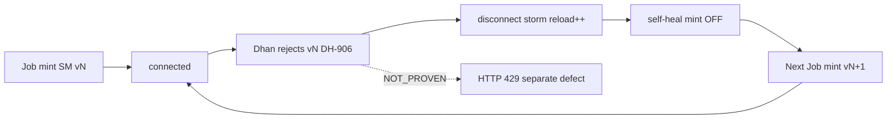

# 21_POST_RECOVERY_RCA_ADDENDUM_V257_V258.md

> **ADDENDUM ONLY** — does not overwrite original audit timestamps in 00–20.

- RCA start: `2026-08-16T07:34:46Z` / `2026-08-16 13:04:46 IST`
- GitHub main (authority for code): `41f7a80cf0c31711f4c26d46fdc0e3f26fc6a311`
- Serving SHA (runtime): `a48e7b3c7c086a21352f718355d1c12d4a48955b`
- Revalidated URL NOW: connected=True secret=v258 LIVE=False orders=False expires=2026-08-17T07:16:47+00:00 reload_count=1682
- Preservation: **v258 connected, LIVE=false** — this RCA did **not** rotate/mint/deploy/mutate.

## 1. Most likely root cause

Premature Dhan auth rejection of an otherwise clock-valid access token (H7), surfaced as TOKEN_EXPIRED_OR_INVALID (H4 labeling). For v254-v257 the first reject occurs BEFORE the next Secret Manager version exists, so Genesis remint (H1) is not the first-cause of those disconnects. With web self-heal mint OFF, the service storms reloads (H5) until scheduler or manual recovery triggers Cloud Run Job mint (H2). Remint then makes prior versions permanently unusable (H1 secondary). HTTP 429 is a separate real defect (H3) — NOT_PROVEN as the invalidation cause.

## 2. Alternative causes

- External non-Genesis Dhan login/session revoke using same API credentials (H8-adjacent, not SM-visible).
- Overlapping recovery remints amplifying churn after outages (H2).
- Multi-instance cache skew (H6) — possible, not proven.
- 429-induced invalidation (H3) — not proven.

## 3. Exact evidence timeline (v254–v258)

| Ver | Mint IST | Initiator | Job creator | Job exec | First TOKEN_EXPIRED log IST | First broker-down IST | Life h | Premature before next mint | Next mint | Recovery h |
|-----|----------|-----------|-------------|----------|-----------------------------|-----------------------|--------|----------------------------|----------|------------|
| v254 | 2026-08-16 01:49:07 IST | MANUAL_RECOVERY_SA | gs3-token-recovery | rotate-rbvhd | 2026-08-16 04:38:32 IST | 2026-08-16 04:38:32 IST | 2.82 | True | 255 | 2.86 |
| v255 | 2026-08-16 07:30:16 IST | CLOUD_SCHEDULER | gs3-scheduler | rotate-2nbfj | 2026-08-16 08:30:09 IST | 2026-08-16 08:20:05 IST | 0.83 | True | 256 | 0.84 |
| v256 | 2026-08-16 09:10:39 IST | MANUAL_RECOVERY_SA | gs3-token-recovery | rotate-dnr2r | 2026-08-16 09:53:20 IST | 2026-08-16 09:53:20 IST | 0.71 | True | 257 | 0.24 |
| v257 | 2026-08-16 10:07:57 IST | MANUAL_RECOVERY_SA | gs3-token-recovery | rotate-56gcf | 2026-08-16 12:21:07 IST | 2026-08-16 12:21:07 IST | 2.22 | True | 258 | 0.43 |
| v258 | 2026-08-16 12:46:52 IST | MANUAL_RECOVERY_SA | gs3-token-recovery | rotate-gdn6k | - | - | - | False | - | - |

Note: Dedicated Cloud Logging filter for raw `DH-906`/`Invalid Token` textPayload returned **0** rows in 3d; app maps those to `TOKEN_EXPIRED_OR_INVALID` (H4). First 429 timestamps remain in JSON pack.

**v257→v258:** v257 disconnected ~12:21 IST 2026-08-16 while clock still showed ~21h remaining; v258 minted ~12:46 IST (07:16 UTC) via recovery SA; URL now connected on v258.

## 4. All token authorities

| Authority | CAN_MINT | CAN_TRIGGER | CAN_WRITE_SM | Class |
|-----------|----------|-------------|--------------|-------|
| Cloud Scheduler genesis-system3-dhan-token-rotate-daily | False | True | False | CAN_TRIGGER_ROTATOR |
| Cloud Run Job genesis-system3-dhan-token-rotate (SA genesis- | True | False | True | CAN_MINT + CAN_WRITE_ACCESS_TOKEN_SECRET |
| GitHub workflow GCP Dhan Token Rotation Manual Recovery | False | True | False | CAN_TRIGGER_ROTATOR |
| GitHub Actions generally / deploy workflow | False | False | False | NOT_AUTHORIZED_TO_MINT (deploy may updat |
| Web self-heal / canonical_rotation invoke | False | CONDITIONAL | False | READ_ONLY mint path when DHAN_CANONICAL_ |
| ops-controller / local dhan_token_auto_refresh / watchdog | False | False | False | NOT_AUTHORIZED / no-op mint on current m |
| default compute / rank job SA | False | False | False | READ_ONLY (secretAccessor on token per b |
| Web SA genesis-system3-web / system3-web | False | False | False | READ_ONLY secretAccessor |
| Job IAM invokers (live policy) | False | True | False | CAN_TRIGGER_ROTATOR |
| SM secretVersionAdder principals (live) | IF_ALSO_RUNS_JOB_CODE | False | True | CAN_WRITE_ACCESS_TOKEN_SECRET |
| github-actions-deploy SA | False | False | False | NOT_AUTHORIZED_TO_MINT (IAM binder roles |
| 802404398783-compute default compute SA | False | False | False | READ_ONLY secretAccessor |

Live Job IAM bindings: `[{'role': 'projects/system3-openalgo-safe/roles/system3RunJobIamBinder', 'members': ['serviceAccount:github-actions-deploy@system3-openalgo-safe.iam.gserviceaccount.com']}, {'role': 'roles/run.invoker', 'members': ['serviceAccount:gs3-scheduler@system3-openalgo-safe.iam.gserviceaccount.com', 'serviceAccount:gs3-token-recovery@system3-openalgo-safe.iam.gserviceaccount.com']}]`

Live SM versionAdders: `['serviceAccount:genesis-system3-dhan-rotator@system3-openalgo-safe.iam.gserviceaccount.com']`

Scheduler Dhan jobs: `[{'name': 'genesis-system3-dhan-token-rotate-daily', 'schedule': '30 7 * * *', 'timeZone': 'Asia/Kolkata', 'state': 'ENABLED', 'httpTarget': 'https://run.googleapis.com/v2/projects/system3-openalgo-safe/locations/asia-south1/jobs/genesis-system3-dhan-token-rotate:run', 'attemptDeadline': '180s'}]`

## 5. HTTP 429 request graph (separate)

{
  "frontend_polling": [
    "dashboard/frontend/src/hooks/useData.ts \u2014 CORE/BROKER/LIVE_BOARD/SECONDARY setIntervals; /api/batch/market-data, /api/broker/status, /api/batch/chains, positions-holdings",
    "useWebSocket.ts \u2014 fallback polling when WS offline",
    "useWebSocketProd.ts \u2014 heartbeat + state intervals"
  ],
  "backend_polling_loops": [
    "index_chain_micro_loop paced OC ~3.4s gap",
    "market_top_micro_loop from paced cache",
    "state sync / tick loops / cloud_status_probe"
  ],
  "direct_dhan_calls": [
    "core/brokers/dhan/market_ltp.py \u2014 ltp/ohlc/quote REST",
    "core/data/datasource_manager.py \u2014 option_chain paced",
    "cloud_status_probe / profile bounded for broker status"
  ],
  "caches": [
    "_PUSHED_CHAIN_CACHE / paced_chain_cache",
    "token cache TTL 30s",
    "broker status cache"
  ],
  "retries_concurrency_duplicates": "FE retries on failure with staggered chain polls; backend paced OC; duplicate callers possible across tabs (hidden-tab NOT_PROVEN)",
  "hidden_tab_polling": "NOT_PROVEN in this RCA pass (needs browser network while tab hidden)",
  "429_classification": "UNRELATED_BUT_REAL_DEFECT",
  "429_as_token_invalidation_cause": "NOT_PROVEN"
}

Log counts (3d sample): 429=66, DH-906=0, 401=0, broker_down=262, 429-near-auth(5m)=13.

**429 vs token invalidation:** NOT_PROVEN as cause; classify as **UNRELATED_BUT_REAL_DEFECT** pending market-hours Dhan-tagged metrics.

## 6. Affected source files (current main)

- `scripts/gcp_dhan_token_rotation_job.py` — sole mint
- `core/brokers/dhan/cloud_runtime_patch.py` — self-heal invoke gate
- `core/brokers/dhan/cloud_token_provider.py` — SM dynamic load
- `core/brokers/dhan/dhan_readonly.py` — DH-906 churn warning comments
- `core/brokers/dhan/market_ltp.py` — LTP/OHLC/quote
- `core/data/datasource_manager.py` — paced OC
- `dashboard/frontend/src/hooks/useData.ts` — FE pollers
- `.github/workflows/gcp-dhan-token-rotation.yml` — manual recovery trigger
- `deploy/gcp/system3_iam_baseline.json` — adder/accessor split

## 7. Recommended minimum permanent fix (DO NOT IMPLEMENT IN THIS PASS)

1. Enforce single mint authority with mutex/lease; reject overlapping Job executions.
2. Distinguish UI/API errors: `DHAN_TOKEN_REJECTED` vs `TOKEN_CLOCK_EXPIRED` vs `TRANSIENT`.
3. Exponential backoff on auth-reject reload (stop 900+ reload storms).
4. Alert on broker-down + on AddSecretVersion frequency.
5. After each mint, prove previous version rejected (documents H1) in controlled test env.

## 8. Recommended regression tests

- Contract: self-heal env must be 0 on web.
- Only rotator SA has secretVersionAdder on dhan-access-token.
- Error taxonomy unit tests for DH-906 mapping.
- Job overlap lock test.
- Poller does not call Dhan OC unboundedly (paced gap).

## 9. Recommended GCP/IAM changes (design only)

- Confirm Job invokers = scheduler SA + recovery SA only.
- Confirm secretVersionAdder = rotator SA only (deny others).
- Disable/destroy old access-token versions after N (hygiene).
- Monitoring alert: broker disconnect + AddSecretVersion rate.

## 10. Production re-proof plan

1. URL `/api/broker/status` connected=true secret>=258 LIVE=false.
2. No new SM version unexpectedly for soak window.
3. Market-hours: measure time-to-DH-906 with zero extra mints.
4. Log instance+version on probes.

## 11. Genuine user action

- **Only if TOTP/PIN drift again:** ensure `dhan-totp-secret` latest ENABLED (no chat paste).
- Otherwise ChatGPT/Cursor can proceed with RCA-driven fixes after authorization — **no break-glass required for analysis**.

## Hypotheses H1–H8

### H1_competing_mint_invalidates_previous
- Verdict: **SECONDARY_AFTER_REMINT_NOT_ROOT_OF_FIRST_REJECT** (confidence HIGH)
- For:
  - Code comments state minting a new token invalidates prior Cloud token (DH-906 churn).
  - Every AddSecretVersion for v254-v258 is by genesis-system3-dhan-rotator SA; next mint follows disconnect recovery.
  - After remint, old version is expected dead (single-active-token behavior).
- Against:
  - For v254-v257, first broker-down / TOKEN_EXPIRED_OR_INVALID occurs BEFORE the next SM version is created (premature_reject_before_next_mint=true).
  - Therefore a Genesis remint cannot be the cause of the first premature reject of that same version.
- Remaining: Controlled mint while prior still accepted (authorized experiment) to prove Dhan single-active policy; does not explain first reject without remint.

### H2_scheduler_manual_deploy_overlap
- Verdict: **PARTIAL_TRIGGER_OVERLAP_REAL** (confidence HIGH)
- For:
  - Job invokers live: gs3-scheduler + gs3-token-recovery only (run.invoker).
  - v255 creator=gs3-scheduler (07:30 IST daily); v254/v256/v257/v258 creator=gs3-token-recovery (manual recovery).
  - Multiple recovery mints same day after disconnects (dense remint cadence).
- Against:
  - Deploy SA is Job IAM binder / Secret IAM binder — not secretVersionAdder; deploy must not mint.
  - Web self-heal DHAN_CANONICAL_ROTATION_SELF_HEAL=0 — web does not remint.
  - Overlap explains remint frequency AFTER outages, not the first premature reject.
- Remaining: Optional: map each recovery workflow_dispatch to exact execution id for v256-v258.

### H3_rate_limit_causes_invalidation
- Verdict: **UNRELATED_BUT_REAL_DEFECT** (confidence MEDIUM)
- For:
  - HTTP 429 events observed in 3d web logs count=66.
  - Frontend useData.ts documents prior OC stampede risk and rate-limit backoff.
- Against:
  - Weak 5-min co-occurrence corr_count=13; disconnects labeled TOKEN_EXPIRED_OR_INVALID not rate-limit.
  - Auth reject classifier is distinct from 429; correlation is not causation.
- Remaining: Tag Dhan upstream 429 body vs Cloud Run platform 429; market-hours request-rate metrics.

### H4_misclassification_of_failure_as_token_invalid
- Verdict: **PARTIAL_CONTRIBUTOR_TO_SYMPTOM** (confidence HIGH)
- For:
  - dhan_readonly.py maps DH-906/Invalid Token/401 → TOKEN_EXPIRED_OR_INVALID even when clock not expired.
  - Observed on v257: hours_remaining ~21 while error TOKEN_EXPIRED_OR_INVALID.
  - 3d Cloud Logging shows TOKEN_EXPIRED_OR_INVALID on self-heal broker-down lines; dedicated DH-906 textPayload filter returned 0 rows in 3d.
- Against:
  - Underlying rejection is still an auth-class failure per classifier design — not a random 5xx.
- Remaining: Capture raw Dhan response body (redacted) on next incident to confirm DH-906 vs other auth codes.

### H5_stale_reload_behavior
- Verdict: **CONTRIBUTOR_NOT_ROOT** (confidence HIGH)
- For:
  - reload_count storms (v257 era 600-900+; process still elevated after v258).
  - Self-heal mint disabled → keeps reloading same rejected SM version.
- Against:
  - Reload alone does not create auth rejection; Dhan rejection is prerequisite.
- Remaining: Per-instance reload metrics / backoff proof after fix.

### H6_multi_instance_token_divergence
- Verdict: **POSSIBLE_NOT_PROVEN** (confidence LOW)
- For:
  - Cloud Run multi-instance + 30s token cache can briefly diverge.
- Against:
  - token_proof.source=GCP_SECRET_MANAGER_DYNAMIC; disconnects correlate with same SM version id rejected.
- Remaining: Log instance id + secret version on each probe during next incident.

### H7_dhan_policy_differs_from_nominal_24h
- Verdict: **MOST_LIKELY_ROOT_FOR_PREMATURE_REJECT** (confidence HIGH)
- For:
  - Useful life to first broker-down for v254-v257 is 0.71-2.82h while expires_at_utc ~24h from mint.
  - Premature reject occurs with NO intervening AddSecretVersion (H1 ruled out as first-cause).
  - All AddSecretVersion principals are rotator SA only — no alternate Genesis writer found for these versions.
- Against:
  - Exact Dhan-side mechanism (session revoke, concurrent login, idle timeout, IP/policy) NOT_PROVEN.
  - Could still be external non-Genesis mint not writing this SM secret (would require another Dhan client_id login).
- Remaining: Soak one token with zero remints + no other Dhan logins; or vendor policy; or capture raw reject body.

### H8_legacy_local_mint_outside_gcp
- Verdict: **CODE_PATHS_DISABLED_NO_EVIDENCE_IN_V254_258** (confidence MEDIUM)
- For:
  - Historical comments: local mint invalidated cloud token.
  - generate_token still exists for Job use.
- Against:
  - AddSecretVersion for v254-v258 principals exclusively genesis-system3-dhan-rotator.
  - codespace_startup/dhan_token_auto_refresh/dhan_startup_check refuse mint on current main.
  - SM secretVersionAdder = rotator SA only.
- Remaining: Confirm no human logged into web.dhan.co / other apps using same API credentials during windows.

## Flow (recurrence)

## Evidence paths

- Local scratch: `C:\System3\Genesis_System3\reports\latest\broker_disconnect_rca_v258`
- `RCA_POST_RECOVERY_V257_V258.json`
- This addendum file in session folder
