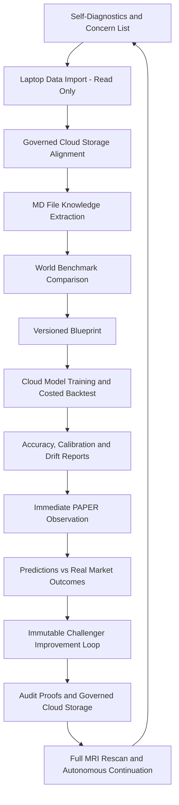
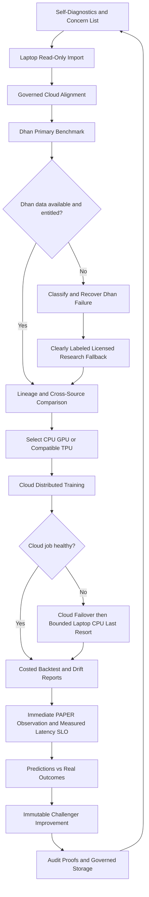
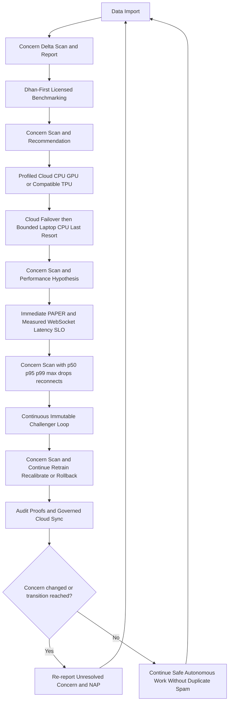
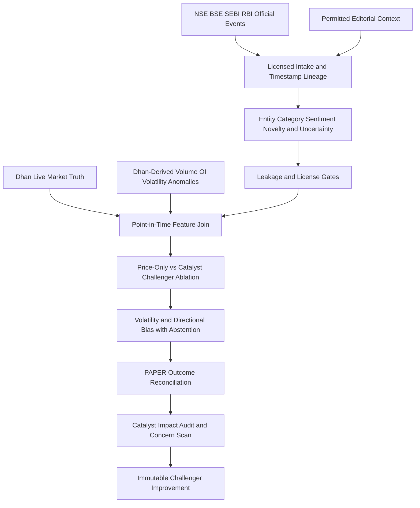
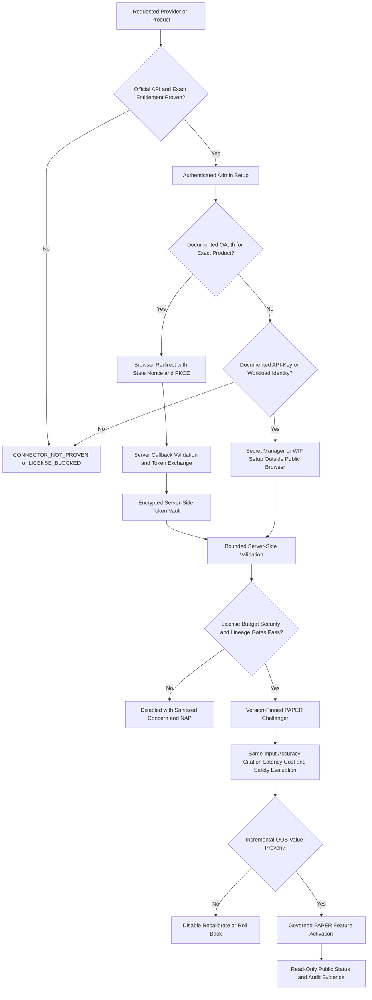

# Genesis System3 Autonomous End-to-End Runbook

**Authority marker:** `SYSTEM3_AUTONOMOUS_E2E_RUNBOOK_V1`

**Role:** Persistent self-instruction and completion ledger contract for Codex,
ChatGPT, Cursor, Gemini, Claude, and every generic/unknown agent operating in
this repository.

## Mandatory re-read boundary

Re-read this runbook from the current checked-out commit immediately before:

1. every merge decision;
2. every deployment or production mutation;
3. every production acceptance or rollback decision;
4. every issue/blocker closure;
5. every final response that claims completion, current state, or user action.

Chat memory, an earlier read, a prior agent summary, and `reports/latest/` do not
satisfy this boundary. Record the runbook path, marker, current Git SHA, and
re-read UTC time in the active completion ledger.

## Authority order

This runbook orchestrates, but does not replace, the more specific authorities:

1. `docs/authority/TEMPORAL_TRUTH_AND_LIVE_EVIDENCE_POLICY.md`
2. `docs/authority/AUTONOMOUS_OPERATIONS_POLICY.md`
3. `docs/project_control/SYSTEM3_MASTER_GOAL_LOCK.md`
4. `docs/END_TO_END_ISSUES_SOLUTIONS_AGENT_POLICY.md`
5. `agent_policy.yaml`
6. `docs/CONTINUOUS_CLOSURE_SYSTEM.md`
7. `docs/PREFLIGHT_CONTROL_PLANE.md`
8. `docs/architecture/INFINITE_GITOPS_AGENT_PROMPT.md`

When two sources appear to disagree, fail closed, prefer the narrower safety or
fresh-evidence rule, and resolve the conflict before transition.

## Permanent safety state

- `ANALYZE_MODE=1`
- `LIVE_TRADING_ENABLED=0`
- `SYSTEM3_LIVE_TRADING_ALLOWED=0`
- `AUTO_EXECUTE_TRADES=0`
- PAPER/analyzer only
- no real order placement, modification, cancellation, or square-off
- no broker secret payload exposure
- no service-account JSON keys
- Dhan is the broker authority; Render and Angel instructions are historical

Only an explicit human break-glass process may authorize LIVE trading or real
orders. Routine autonomy never broadens that authority.

## Start and recovery sequence

For every new request, restart, resumed session, or agent handoff:

1. Record request/investigation start UTC.
2. Re-read `AGENTS.md`, this runbook, and the task-specific authority files.
3. Inspect current local status without overwriting user changes.
4. Fetch and independently identify current remote `main`.
5. Inspect relevant open PRs, branches, workflow runs, issues, and ownership.
6. Generate or consume a fresh `scripts/system3_preflight_control_plane.py`
   snapshot before any production-relevant transition.
7. Classify every inherited claim as fresh live evidence or historical context.
8. Create/update the completion ledger entry and name the active blocker/goal.
9. Continue from current evidence; never continue only from chat narrative.

## Autonomous execution cycle

For each issue or goal:

1. Verify the symptom at the authoritative boundary.
2. State `STATUS`, `IN_PROGRESS`, `CURRENT_STEP`, `NEXT_ACTION`, and
   `USER_ACTION`.
3. Identify root cause, affected surfaces, and the smallest safe solution.
4. Use parallel agents/processes only for independent work with explicit
   ownership; do not allow concurrent edits to the same files.
5. Add or update a failing regression/eval when technically appropriate.
6. Implement on a branch from current `main`; preserve unrelated work.
7. Run focused tests, diff checks, applicable builds, and mandatory gates.
8. Re-fetch before push/merge and reconcile concurrent upstream changes.
9. Create/update the PR with exact evidence, safety state, and known limits.
10. Inspect the exact-head required CI result. Read failed job/step/log/artifact
    before remediation; do not infer failure cause from a red icon.
11. Merge promptly only when exact-head mandatory checks are green.
12. After merge, check canonical Cloud Run deployment immediately.
13. Wait boundedly for exact serving-SHA convergence while continuing safe,
    non-conflicting work.
14. Generate new post-deployment production proof. Pre-fix proof is historical.
15. Close the issue only when the user-visible/runtime result is proven.
16. Append the final completion-ledger entry and verify its hash chain.

## Production and UI proof

A current production/UI claim requires request-scoped evidence generated after
the investigation began. For a post-deploy claim, first prove `/api/deploy/info`
serves the intended GitHub SHA, then:

1. start a new Chrome/WebDriver session against the canonical GCP URL;
2. capture relevant screenshots and visible text;
3. capture same-session read-only APIs and browser console/network failures;
4. compare UI and API semantics, freshness, source, and contradictions;
5. for a full audit, cover all 22 canonical tabs;
6. for option-chain proof, separately verify NIFTY, BANKNIFTY, FINNIFTY, and
   MIDCPNIFTY symbols, source, contracts, expiries, and strikes;
7. re-check serving SHA at the end and record evidence age.

HTTP 200, rendered tabs, green CI, source code, and stored screenshots are not
substitutes for semantic live proof.

## GitHub + Google Cloud + URL + F12 acceptance matrix

Before accepting any production-facing change, prove every applicable column in
one same-SHA transition record:

| Boundary | Required proof |
|---|---|
| GitHub | current remote main, active PR ownership, exact PR-head SHA, required checks, failed job/step/log/artifact, merge SHA |
| Google Cloud | project/region/service, deployment run, candidate and ready revision, traffic allocation, runtime identity, safety env, relevant logs/metrics/errors |
| URL | canonical production URL, `/api/deploy/info` exact serving SHA at start/end, health and relevant read-only APIs |
| Browser/F12 | new browser context, DOM-visible text, screenshot, console errors/warnings, failed requests, XHR/fetch/WebSocket responses, status/content-type/latency, trace when needed |
| Semantics | UI value/source/as-of/freshness/units match API and persisted lineage; empty/loading/stale/replay states are explicit |

Use Playwright/WebDriver automation for repeatability. Manual DevTools/F12 may
supplement evidence, but never replace timestamped machine artifacts.

### External strategy-artifact intake and claim validation

User-supplied reports, generated blueprints and automation backlogs are valuable
requirement inputs, but are not repository, GitHub, GCP, broker or production
authority. Before adopting one:

1. record its path, byte size, SHA-256, encoding/readability and whether the file
   is complete; preserve truncated or malformed endings as a concern;
2. extract each issue ID, URL, SHA, service/project/region, percentage, current-
   state assertion and architectural recommendation into a claim ledger;
3. classify each claim as `USER_REQUIREMENT`, `DESIGN_PROPOSAL`,
   `HISTORICAL_CONTEXT`, `CURRENTLY_VERIFIED`, `CONTRADICTED`, `STALE`,
   `INCOMPLETE_SOURCE` or `UNVERIFIED`;
4. independently verify current issue/PR/workflow state through GitHub, deployed
   identity/config/logs through GCP, broker facts through Dhan, and UI claims
   through a new production browser/API proof session;
5. never treat an issue number, suggested ordering, automatable percentage,
   hostname interpretation, example SHA or confident prose as proof;
6. adopt useful recommendations as measurable controls, tests or decision rows,
   and retain rejected/unsafe/duplicate claims with a reason instead of silently
   deleting them.

The reference file
`audit/USER_RECOMMDATION_FOR _AGENT_UPDATE_RUNBOOK/FOR_INFO_FOR_IMPROMENT.txt`
was inventoried on 2026-08-24 as 20,120 bytes with SHA-256
`C70E3604A18F7EFE5A72A2CC3E686B17E09FDDC17EE35ED31E1D15CBD6203B31`.
It ends mid-URL at `https://token.actions.githubus` and is therefore
`INCOMPLETE_SOURCE`. Its issue-status narratives and percentages remain
unverified until checked against current authorities.

### Priority, dependency and automation-boundary control

- Derive P0/P1 priority from current impact, exploitability, safety, user-visible
  severity and dependency critical path; never inherit priority solely from an
  advisory artifact.
- Maintain an executable dependency DAG for readiness gates. A parent cannot be
  green when a required child is missing, stale, contradictory or blocked.
- `Estimated_Automatable_Percent` is planning metadata only. Completion requires
  acceptance evidence, not reaching a percentage.
- Separate `AUTOMATABLE`, `AUTOMATABLE_WITH_GUARD`, `USER_ACCOUNT_ACTION`, and
  `HUMAN_BREAK_GLASS_ONLY`. LIVE enablement and real orders always remain in the
  last class.
- Each backlog row needs stable ID, owner, current authoritative evidence,
  dependencies, safety boundary, acceptance test, artifact location, exact SHA,
  rollback and closure reason.

### Continuous read-only production sentinel

The permanent sentinel is a separately identified read-only observer, not a
deployment or trading agent. It must:

- use anonymous/public endpoints where intended and a dedicated least-privilege
  identity only where authentication is unavoidable;
- call no order, mutation, token-rotation or LIVE-control endpoint;
- use bounded cadence, jitter, timeout, retry and budget/rate-limit controls;
- record serving SHA/revision, health, semantic tab/API truth, freshness,
  console/network failures and viewport checks without exposing secrets;
- classify `HEALTHY`, `DEGRADED`, `STALE`, `SEMANTIC_MISMATCH`,
  `SERVING_SHA_MISMATCH`, `AUTH_BLOCKED` or `UNAVAILABLE`;
- freeze a bounded defect artifact and open/update one deduplicated blocker when
  state changes; it must not redeploy, repair IAM or mutate production itself.

Sentinel success proves only its sampled contract and observation window. It
does not replace request-scoped post-change proof or market-hours broker parity.

### Deployment authority and supply-chain provenance

- GitHub Actions to Google Cloud uses keyless OIDC Workload Identity Federation;
  no service-account JSON key may be created, exported or stored in GitHub.
- Restrict federation by exact repository/organization and trusted ref or
  environment claims; grant the deploy principal least privilege and separate
  deploy, runtime and broker-token-rotation identities.
- Pin third-party workflow actions to reviewed immutable commit SHAs, minimize
  workflow permissions, require protected environments where applicable and
  prevent untrusted pull-request code from receiving production credentials.
- Record source commit, workflow/run/attempt, builder identity, artifact digest,
  image registry reference, Cloud Run revision, configuration/safety-env digest
  and traffic transition. Verify artifact digest/revision mapping in addition to
  `/api/deploy/info`; a self-reported SHA alone is insufficient provenance.
- Inventory every deployment trigger, webhook, scheduler and external host.
  Canonical GCP must be the sole production deployment authority. A legacy path
  is `SPLIT_BRAIN_DEPLOYMENT_RISK` until disabled and freshly proven inactive;
  do not delete its services or secrets without explicit scoped authority.
- The web runtime cannot invoke the bounded Dhan token rotator. Broker-secret
  access, rotation and deployment identities remain isolated and auditable.

#### Twelve-recommendation completion ledger

Every runbook-upgrade or production-control review maintains the following
ledger. Evidence time is mandatory and the only verdicts are `PASS`, `FAIL`,
`PARTIAL`, or `BLOCKED`. A verdict expires when its named source changes or its
freshness contract expires. Each row must record primary and alternative paths;
an alternative is never permission to bypass the primary path's safety gates.

| ID | Recommendation | Primary path | Safe alternative | Acceptance evidence |
|---|---|---|---|---|
| R01 | Fresh GitHub/GCP provenance | GitHub commit -> Actions run/attempt -> reviewed workflow YAML digest -> Artifact Registry digest -> Cloud Run revision -> traffic | Cloud Build ID + immutable source checksum + produced digest -> revision -> traffic | request UTC, source identities, evidence UTC and complete digest chain |
| R02 | Recommendation ledger/options | this versioned ledger with one current verdict per row | blocker card retaining both paths | status, owner, evidence time, gap and next action |
| R03 | Single production deployer | protected GitHub environment using WIF deploy workflow | governed Cloud Build path selected as the sole authority | all other triggers disabled or `SPLIT_BRAIN_DEPLOYMENT_RISK` |
| R04 | GitHub identity/protection | ruleset/branch protection, required exact-head checks, protected environment, OIDC/WIF least privilege | manual protected-environment approval with the same WIF identity | live ruleset/environment/WIF claims and permissions inventory |
| R05 | Data-integrity audit | versioned read-only dashboard/API contract backed by immutable artifacts | BigQuery audit tables plus object-versioned/retention-locked Cloud Storage | schema-valid response, lineage, bounded artifact links and read-only tests |
| R06 | Dhan rotation governance | dedicated bounded rotator/scheduler identity and metadata-only audit | bounded authenticated recovery authority using documented Dhan capability | cadence, attempt/result/error-class/version metadata; never secret payloads |
| R07 | PAPER reconciliation | immutable identifier joins with exchange/source/receive/simulation timestamps | offline read-only reconciliation over versioned exports | orphan/duplicate/order/quantity/price/fee/PnL/terminal mismatch evidence |
| R08 | Feed latency/reliability | timestamped telemetry with p50/p95/p99/max | bounded replay/load observation | sample count, drops, reconnects, stale and out-of-order counts |
| R09 | DAG stress/chaos | pytest property/state-machine/fault-injection tests | Locust for bounded load/latency; Chaos Mesh only on a governed Kubernetes target | fail-closed dependency and recovery assertions |
| R10 | Policy schema lifecycle | versioned JSON Schema, validator and explicit migration | backward-compatible reader during a bounded migration window | schema version, validation, migration and compatibility tests |
| R11 | IAM recovery separation | read-only sentinel freezes evidence and queues a guarded remediation workflow | audit-log Cloud Function detects/queues only | allowlisted plan, lock, before/after, rollback and immutable audit |
| R12 | Workflow supply-chain hardening | reviewed actions pinned to immutable commit SHAs and minimum permissions | first-party scripts with pinned runtime/toolchain | workflow scan, permission inventory and exact reviewed digests |

##### Request-scoped reconfirmation — 2026-08-24T09:20:29Z

The twelve governance *contracts* remain implemented (`PASS`) at current source
`9dbf1911d016bcd3611651390cfca28658d96d41`. A contract PASS is not an
operational PASS. The operational column below is intentionally fail-closed and
must not be rewritten green merely because the recommendation exists in this
runbook. Primary and alternative paths remain the paths in R01-R12 above.

| ID | Contract verdict | Current operational verdict | Evidence time UTC | Current evidence / unresolved concern | Next action |
|---|---|---|---|---|---|
| R01 | PASS | PASS | 2026-08-24T09:20:55Z | GitHub main freshly fetched; serving `a764f990...` maps through deploy run `32707463170`, image digest `sha256:120036a3...`, revision `00584-faq`, 100% traffic | repeat after next deploy; self-reported API SHA alone remains insufficient |
| R02 | PASS | PASS | 2026-08-24T09:20:29Z | versioned ledger, fixed verdict enum, evidence time and both paths are present | append only on material evidence change |
| R03 | PASS | PARTIAL | 2026-08-24T09:20:55Z | canonical GitHub Actions deploy is proven; exhaustive current Cloud Build/direct-writer inventory is not yet attached to this request | run single-writer inventory; emit `SPLIT_BRAIN_DEPLOYMENT_RISK` on any second writer |
| R04 | PASS | FAIL | 2026-08-24T09:27:49Z | GitHub API returned `404 Branch not protected`; repository rulesets list is empty; environments have no protection rules. WIF provider is ACTIVE and restricted to repository/owner IDs plus `refs/heads/main` | account owner enables main/environment protection, or retain the documented WIF-restricted alternative and explicit blocker |
| R05 | PASS | PARTIAL | 2026-08-24T09:20:29Z | schema/read-only/immutable-storage contract exists; full production data-integrity cards and append-only BigQuery evidence are not freshly proven | deploy and prove the versioned dashboard/API plus immutable object and BigQuery rows |
| R06 | PASS | PASS | 2026-08-24T08:52:17Z | deploy workflow proved isolated rotator/scheduler safety; web rotation switches remain disabled | retain metadata-only attempt/result logging and bounded recovery authority |
| R07 | PASS | PARTIAL | 2026-08-24T09:20:29Z | timestamp/join/fail-closed PAPER contract exists; full current lifecycle mismatch report is not attached | run exchange/source/receive/simulation reconciliation and publish mismatch counts |
| R08 | PASS | PARTIAL | 2026-08-24T09:20:29Z | percentile/drop/reconnect/stale contract exists; request-scoped 60-minute samples are pending | capture p50/p95/p99/max/drop/reconnect/stale/out-of-order during the 60-minute proof |
| R09 | PASS | PASS | 2026-08-24T09:20:29Z | pytest/property/state-machine/fault-injection-first and governed Locust/Chaos-Mesh alternatives are locked | retain fail-closed tests for every new dependency edge |
| R10 | PASS | PASS | 2026-08-24T09:20:29Z | `agent_policy.v4` schema, migration and compatibility rules are canonical | reject unknown future major versions and test each migration |
| R11 | PASS | PASS | 2026-08-24T09:20:29Z | sentinel has no repair authority; separate WIF-authenticated repair workflow requires plan/allowlist/lock/before-after/rollback/audit | keep destructive, privilege-expanding, WIF-destroying and ambiguous drift human-gated |
| R12 | PASS | PASS | 2026-08-24T09:20:29Z | immutable-action/minimum-permission contract and exact-head workflow policy checks are active | rescan every workflow change; first-party pinned-runtime path remains the alternative |

##### Dhan equity, CE/PE and prediction coverage ledger

`RELIANCE` was a production-browser sample, never the configured universe. The
fresh preferred detailed Dhan master synchronized at 2026-08-24T09:26:59Z
(SHA-256 `9CB5172AC21BD5936DB8CA83E02A40C1CF65E0FDD162BB5CABF2B8D7A224A27F`)
contained 208 stock-option underlyings (208 NSE, 206 BSE, 206 overlapping),
67,172 NSE stock-option contracts, 35,180 BSE stock-option contracts, 9,874 NSE
cash security IDs and 13,554 BSE cash security IDs. Counts are temporal evidence,
not constants; refresh from Dhan's official master before every current claim.

| Coverage surface | Verdict | Primary path | Safe alternative | Acceptance/blocker |
|---|---|---|---|---|
| Current NSE/BSE master ingestion | PARTIAL | daily official detailed/compact Dhan sync with checksum/as-of metadata; all consumers resolve the synced master first | bundled master only as explicit stale/degraded emergency fallback | production currently exposes the bundled 211-underlying snapshot; redeploy and prove official-sync source/count/digest |
| NSE/BSE cash catalog | PASS_SOURCE / UNPROVEN_LIVE | bounded Dhan quote batches of at most 1,000 security IDs at the documented quote cadence | Dhan WebSocket shards up to the documented connection entitlement | source enumeration is implemented; fresh quotes for every cash ID and UI coverage are not yet proven |
| NSE/BSE CE/PE master coverage | PASS_SOURCE / UNPROVEN_LIVE | quote-batch all option security IDs for ranking, then paced/on-demand full-chain detail | WebSocket quote shards plus option-chain detail for promoted candidates | every master underlying must have CE and PE; missing-side list fails closed; all-contract fresh live coverage is pending |
| Equity option rotation | PARTIAL | bounded rotating shards with explicit visited/missing/coverage/cycle fields | distributed lease-backed shards when Cloud Run horizontal scale is governed | in-memory full-cycle accounting is implemented; durable cross-instance coverage ledger is pending |
| Top CE/PE benchmark | PARTIAL | Dhan quote/chain ranking with same-time Moneycontrol reference comparison | licensed independent exchange/vendor validation | Moneycontrol/Chartink remain reference/catalyst inputs, never broker truth; discrepancy reasons must be visible |
| Multibagger research | BLOCKED | survivorship-safe point-in-time cash universe, fundamentals/corporate actions, price/volume/catalyst features and leakage-safe long-horizon tournament | transparent factor baseline while advanced challengers remain research-only | no candidate may be displayed as guaranteed; current verified model/outcome lineage is insufficient |
| Seven PAPER horizons | PARTIAL | `1_week`, `3_weeks`, `1_month`, `3_months`, `6_months`, `1_year`, `2_years` with immutable prediction IDs and realized outcomes | abstaining baseline when coverage/calibration is insufficient | horizon schema is implemented; forward outcomes necessarily remain pending until each horizon matures |
| Continuous learning/RL | BLOCKED | immutable challenger retraining/recalibration from reconciled PAPER outcomes; governed promotion and rollback | scheduled feature ablation/recalibration only | no in-place champion mutation, uncontrolled RL, LIVE enablement or capital deployment; BigQuery outcome evidence is not yet proven |
| Issue #188 full closure | PARTIAL | exact-serving one-document 22-tab desktop/mobile API/UI proof plus 60 uninterrupted market minutes | bounded repeated proof windows only when the exchange session cannot supply 60 minutes; never relabel shorter evidence | PR #335 owns the proof harness; Overview/Genesis/time-series/model evidence and full current-master live coverage remain unresolved |

##### Live unresolved-issue CSV and user-input contract

The canonical Excel-readable projection of Continuous Closure issues is:

`audit/live_agent_issue_ledger/SYSTEM3_LIVE_UNRESOLVED_ISSUES.csv`

Use `scripts/system3_live_issue_ledger.py` to record or scan evidence. This CSV
extends the canonical blocker cards/proof ledger; it does not replace GitHub
Issue #188, `BACKLOG.md`, the JSONL proof ledger, or exact-serving UI evidence.

- Detect terminal/log keywords such as ERROR, FAIL, WARNING, BLOCKED, WAITING,
  DEGRADED, storage exhaustion and browser/ChromeDriver failures, but never
  promote a keyword match into a root-cause or product-failure claim without
  current authoritative reproduction.
- Attempt the smallest safe resolution first. If unresolved, upsert the row with
  evidence, attempted fixes, owner, next action and explicit
  `user_input_required`. When that field is `YES`, `user_input_question` is
  mandatory. Never use the CSV to request routine work the agent can perform.
- Preserve resolved rows with resolution UTC/evidence. Never delete history to
  make the ledger green. Repeated events increment `occurrence_count`.
- Sanitize secret-like values before persistence. Do not capture response bodies,
  Dhan token values, credentials, authorization headers or service-account keys.
- The writer uses a same-directory temporary file and atomic replace. If Excel
  holds an exclusive lock, append metadata to `.csv.pending.jsonl`; the next
  successful invocation must merge the spool without loss. Users may therefore
  keep the CSV open read-only; an Excel lock is visible, not silently ignored.
- Storage pressure is HIGH when it blocks evidence/test/browser work. Report it
  immediately, preserve user files, use the forensic cleanup authority, and
  record free-space evidence plus the safe recovery action.
- Chrome GCM messages such as `PHONE_REGISTRATION_ERROR` and
  `DEPRECATED_ENDPOINT` are normally background registration diagnostics. Mark
  them INFORMATIONAL/safe-to-ignore only after proving the required browser
  session, production URL, UI/API capture and exit result were unaffected.
- Every production fix still requires new desktop/mobile UI content and visual
  quality review from a trader's perspective. A rendered tab, CSV row, HTTP 200,
  CI green state or backend response alone is not final user proof.

#### GitHub protection and single-deployer enforcement

- Protect `main` with pull-request review, required exact-head checks, stale
  approval dismissal and conversation resolution. Protect the production
  environment with trusted-branch/tag restrictions and required reviewers when
  account policy supports them.
- Prefer repository/ref/environment-bound OIDC claims and a dedicated WIF deploy
  principal. If environment protection is unavailable, restrict WIF attributes
  to the exact repository, workflow path and trusted ref and retain an explicit
  account-level blocker.
- Enumerate GitHub workflows, Cloud Build triggers, direct `gcloud` lanes,
  schedulers and external webhooks. More than one enabled production writer is
  `SPLIT_BRAIN_DEPLOYMENT_RISK`; freeze promotion until one path is selected and
  the others are proven unable to shift traffic.
- Pin every third-party GitHub Action to a reviewed full commit SHA. Tags and
  floating major versions are not immutable. Default workflow permissions to
  read-only and grant `id-token: write` or other scopes only in the job that
  requires them.

#### Guarded IAM detection and remediation

The production sentinel is anonymous/read-only where possible and has no IAM
repair authority. On suspected drift it freezes sanitized evidence and opens or
updates one deduplicated blocker. A Cloud Function consuming IAM audit logs may
classify and queue that blocker, but must never grant a role directly.

Repair uses a separate authenticated, least-privilege, pre-approved workflow
bound to trusted `main`. It accepts only allowlisted baseline drift, produces a
dry-run plan, obtains a concurrency lock, records sanitized before/after
bindings, applies the minimum change, verifies it, and records a tested rollback
plus immutable audit event. Destructive, privilege-expanding, WIF-destroying,
unknown-principal, organization-level or ambiguous changes remain human/account
gates. Detection success never authorizes remediation.

#### Policy schema lifecycle

`agent_policy.yaml` declares its policy/schema version and validates against the
canonical versioned JSON Schema. A breaking change requires a new schema version,
documented source/target migration, idempotent migration test, rejection of
unknown future major versions, and a bounded backward-compatibility window.
Validators fail closed; they never silently discard unknown safety fields.

### Master production-closure contract

**Mission:** Move Genesis System3 toward the maximum safely achievable
production PASS. Do not stop at reporting when a safe, non-overlapping,
authorized remediation remains. Never manufacture a PASS, weaken a gate, or
cross the LIVE/order/secret/account boundary to increase the score.

For each run, maintain one deduplicated gate ledger with `PASS`, `FAIL`,
`UNPROVEN`, `NOT_APPLICABLE`, or `BLOCKED_EXTERNAL`, current evidence UTC,
evidence source, owner, defect/root cause, fix/PR/deployment, acceptance test and
next action. Re-evaluate a downstream gate whenever its upstream SHA, revision,
data source, credential version, contract or evidence window changes.

| Gate | Required current proof |
|---|---|
| G01 Repository SHA | current GitHub `main` and canonical serving SHA equality or explicit deployment-in-progress state |
| G02 Cloud Run MRI | project/region/service, ready revision, traffic, digest, runtime identity, scaling, safety env names/values and Secret Manager references without payloads |
| G03 Broker MRI | read-only Dhan auth/profile/funds/holdings/positions status; rotate only through bounded authority when fresh evidence proves recovery is required |
| G04 Market-data MRI | NIFTY, BANKNIFTY, FINNIFTY and MIDCPNIFTY source, as-of/age, contracts, expiries and strikes; additional supported underlyings reported separately |
| G05 API MRI | allowlisted read-only routes with status, content type, bounded payload semantics, source timestamps and latency |
| G06 UI MRI | all 22 canonical tabs: `OPENS`, `DATA`, `API`, `FRESH`, `ERRORS`, `VERDICT` from one new production browser lifecycle |
| G07 API/UI parity | broker, funds, holdings, positions, indices and option-chain values/source/as-of/units agree or contradiction is explicit |
| G08 Frontend forensics | console, page, hydration, failed fetch/XHR/WebSocket, timeout and infinite-loading evidence |
| G09 Cloud-log correlation | browser trace/request ID and UTC window map to Cloud Run revision/request/backend outcome without secret payloads |
| G10 Repository deep MRI | current remote-main scan of TODO/FIXME, mock/demo/synthetic truth, dead/duplicate endpoints, stale workflows, missing tests and ownership overlap |
| G11 Root-cause engine | reproduce -> trace system cause -> search siblings -> smallest systemic fix -> regression proof; never cosmetic string suppression |
| G12 Test pyramid | static/schema, unit, integration, regression, browser and safety-lock tests proportionate to risk |
| G13 PR quality | exact defect, root cause, owned files, tests, before/after evidence, known limits and rollback |
| G14 Merge authority | current-base/exact-head required checks, reviews/rulesets and no conflicting ownership |
| G15 Deployment verification | intended source SHA, workflow/run, image digest, ready revision and 100% intended traffic |
| G16 Post-deploy proof | new broker, market, API, UI, parity and log proof after the verified revision became ready |
| G17 Continuous repair | repeat MRI -> root cause -> fix -> test -> PR -> deploy -> fresh proof while safe independent work remains |
| G18 Safety | `ANALYZE_MODE=1`; LIVE/order locks `0`; no real order or secret exposure |
| G19 Issue #188 coordination | current ownership/progress record using the required `RHUI_PROGRESS_V2` fields and evidence links |

#### Safe API and log-correlation law

Build the API MRI allowlist from current remote source and route metadata; do
not run an inherited bulk endpoint list blindly. Deny or require special review
for secret/audit-secret, mutation, order, rotation, runner, export or unknown
compatibility routes. Use GET/HEAD only where source proves read-only behavior,
with timeout, concurrency/rate, response-size and evidence-retention bounds plus
recursive secret redaction. Record status, content type, latency, byte count,
schema/semantic verdict, source/as-of time and sanitized request/correlation ID.

Correlate browser failures by request/correlation ID when available; otherwise
use a narrow UTC window, exact URL/method/status and revision. Absence of a log
match is `UNPROVEN`, not proof that the backend was never called.

#### Repository deep-MRI and duplication law

Run the deep scan against freshly fetched remote `main`, then compare active PR
heads and Issue #188 ownership before using local findings. Classify mock/demo
references by test fixture, documentation, safe simulator or production-truth
risk; filename/string matches alone are not defects. Confirm route reachability
from registration and consumers before declaring an endpoint dead. Route each
verified defect to one smallest non-overlapping lane and transfer evidence when
another current owner exists.

#### Stop conditions

- `STATE_A_VERIFIED`: every applicable required gate has fresh PASS evidence;
  remaining items are explicitly not applicable.
- `STATE_B_EXTERNAL_BLOCKER`: only verified account, entitlement, billing, MFA,
  destructive, LIVE/order or other non-delegable authority prevents progress;
  publish the smallest secret-safe NAP and continue any independent lane.
- `STATE_C_OWNERSHIP_BLOCKER`: a current agent/PR owns the exact files/root-cause
  lane; post evidence to the coordination record and do not create a duplicate.

Do not use a stop state because work is lengthy, CI is running, evidence is
yellow, or one lane is blocked while another safe lane remains executable.

#### Issue #188 `RHUI_PROGRESS_V2` contract

At task start, after each material state change, and at handoff, post one
deduplicated update containing: capture UTC/IST; agent/lane and owned files;
current main/PR-head/serving SHA; workflow/run/attempt; image digest/revision/
traffic; safety state; broker state without secrets; four-index chain counts and
freshness; 22-tab/API/UI verdicts; defect/root cause/fix/tests; PR/deployment/
proof links; blockers/owner; next action; and `HUMAN_ACTION_REQUIRED`. Update
only when evidence or state changes; do not spam unchanged concerns.

#### User result and production score

Report `Production Score = freshly PASS applicable gates / applicable required
gates * 100`, with numerator, denominator, capture window and excluded
`NOT_APPLICABLE` gates. `UNPROVEN`, stale, FAIL and blocked gates are never
counted green. Present:

- `GREEN - WORKING`: freshly proven items and evidence time;
- `RED - BROKEN`: symptom, root cause, fix/owner and current status;
- `YELLOW - UNPROVEN`: exact missing or stale evidence;
- `FIXED DURING RUN`: before/after SHA, PR, deployment and proof;
- `Remaining Top 20`: evidence-ranked P0/P1/P2, owner and next action (fewer
  rows when fewer verified items exist; never invent filler);
- `Human Action`: YES/NO and the smallest exact action when YES.

### Data-integrity and PAPER lifecycle acceptance

The `data-integrity` tab must expose evidence-backed summaries, not merely links
to reports. At minimum show dataset/source/as-of/age, coverage/gaps/duplicates,
schema and checksum/manifest status, lineage versions, broker/UI parity,
prediction reconciliation, PAPER lifecycle mismatches and serving provenance.
Every card links to a bounded immutable artifact and clearly distinguishes fresh
production observation from stored history.

The dashboard/API contract is schema-versioned and read-only. It includes
`schema_version`, `captured_at_utc`, evidence class/max age, source/dataset and
as-of/receive times, coverage/gap/duplicate counts, manifest/checksum and lineage
versions, serving revision/image/source SHA, safety state, and bounded artifact
references. The preferred persistence path is immutable/versioned Cloud Storage
objects; BigQuery append-only audit tables plus object-versioned or
retention-locked Cloud Storage are the analytical alternative. Neither path may
expose secret payloads or permit a public caller to mutate evidence.

PAPER reconciliation is a read-only join across signal, prediction, simulated
order, simulated fill, position, fees/costs and PnL identifiers. Never infer a
missing fill, rewrite an execution record or force balance. Report orphan,
duplicate, out-of-order, quantity/price/fee/PnL and terminal-state mismatches,
with counts, samples, age and ownership; unresolved material mismatches fail the
applicable readiness gate closed.

Every joined lifecycle row aligns `exchange_event_at`, `source_observed_at`,
`received_at`, and `simulation_event_at` with timezone and clock-quality state.
PAPER fills are modeled assumptions and must never be described as broker fills,
real execution quality, or evidence that a real order would have executed.

## Full data-to-decision lifecycle

Every material data/model/prediction request must create a current coverage
matrix for this chain:

```text
instrument master -> raw ingestion -> immutable historical lake -> validation
-> point-in-time feature store -> labels/horizons -> baselines/challengers
-> leakage-safe backtest -> calibration/robustness -> model registry
-> row-level prediction ledger -> PAPER outcomes -> monitoring/retraining
-> API -> charts/tables/text -> same-session production proof
```

For every stage classify `IMPLEMENTED_AND_PROVEN`, `IMPLEMENTED_NOT_PROVEN`,
`PARTIAL`, `MISSING`, `BLOCKED_EXTERNAL`, or `NOT_APPLICABLE`. A filename,
function, endpoint, or old artifact can prove existence only, never completeness.
If a required stage is missing, implement the smallest durable stage and its
tests, or open a blocker card with measurable acceptance criteria and continue
other safe work.

## Laptop intake -> cloud research/PAPER loop

This section is a permanent agent instruction for user-supplied historical
trading data, market-data exports, Markdown knowledge files, and related local
reference material.

### 1. Data import

- Inventory user-authorized laptop input paths read-only; record file path,
  type, bytes, modified time and content hash without printing secrets.
- Use the laptop only as an intake/fetch boundary for this workflow. Do not run
  bulk transformation, training, backtests, model serving, or trading loops on
  the laptop unless cloud execution is verified impossible and a separately
  documented bounded fallback is required.
- Detect CSV/Parquet/JSON/database/Excel/MD schemas; prefer CSV only for simple
  interoperable exchange. Prefer Parquet for large typed analytical datasets
  after preserving immutable raw originals.
- Upload authorized data to governed cloud object/dataset storage with
  encryption, least privilege, checksum, manifest, schema/version, source,
  license, as-of/availability time and retention classification.
- Align data with the repository's versioned instrument, feature, label and
  dataset contracts. Git stores code, small schemas, manifests, hashes and
  compact evidence—not large/raw market datasets, credentials or secret data.
- Prove row counts, time ranges, symbols/security IDs, expiries, intervals,
  missingness, duplicates, timezone, checksum and source lineage before use.

### 2. Knowledge extraction from Markdown

- Parse every in-scope MD file completely, including tables, links, code blocks,
  assumptions, requirements, decisions, contradictions and unresolved items.
- Preserve citations to source file/path/heading and distinguish user intent,
  historical claim, proposed design and verified fact.
- Extract the maximum useful knowledge into a deduplicated requirement/feature/
  risk/decision matrix; do not treat repeated or confident prose as proof.
- Compare material feature/model ideas against multiple current primary papers
  and official provider sources. Record research date, version, applicability,
  licensing, data requirements and contradictory evidence.
- Auto-recommend a feature/model blueprint using current evidence, but save it
  as a versioned proposal/challenger in the repository. Do not auto-promote it.

### 3. Cloud model training and historical backtest

- Execute reproducible cloud pipelines over the versioned historical snapshot;
  never train directly against a mutable download folder.
- Generate point-in-time features and horizon-specific CE, PE, equity and
  multibagger labels with leakage, survivorship, corporate-action, expiry and
  availability-time tests.
- Train simple baselines, current champion and relevant challengers on identical
  folds/data/cost assumptions. Capture environment/image, seed, config, data,
  feature, label and artifact hashes.
- Run purged/embargoed rolling-origin or walk-forward backtests on past market
  data with realistic brokerage, fees/taxes, spread, slippage, latency,
  liquidity/capacity and expiry behavior.
- Generate predictive, economic, calibration, uncertainty, regime, robustness,
  overfitting and drift reports. A raw accuracy number is never sufficient.

### 4. Immediate PAPER observation, never immediate promotion

- Historical validation may allow PAPER prediction/outcome observation to start
  immediately; no arbitrary ten-day idle delay is required before collecting
  forward evidence.
- Starting PAPER means read-only market observation, predictions and simulated
  lifecycle accounting. It never means a real broker order or LIVE enablement.
- Historical validation cannot substitute for forward PAPER evidence, because
  production data quality, latency, drift, calibration and execution assumptions
  must be measured prospectively.
- Compare every prediction with realized outcomes using `prediction_id`, horizon,
  as-of data, feature/model versions, uncertainty, abstention and cost assumptions.
- Promotion/closure gates remain evidence-based; never relabel fewer observed
  days as ten days or weaken a minimum-forward-window policy to force progress.

### 5. Continuous bounded improvement

- PAPER results may automatically trigger drift analysis, data repair,
  recalibration, feature ablation and challenger retraining.
- Never update active champion weights in place. Every new weight artifact gets
  an immutable version/hash, reproducible evaluation, registry state and rollback.
- Reinforce measured predictive calibration and net economic performance, not
  vague "coordination success" or reward signals disconnected from outcomes.
- Promote only through the same-data champion/challenger and PAPER gates defined
  by the prediction benchmark policy; keep LIVE and orders disabled.
- Save compact audit proofs, metrics, manifests and model metadata in the GitHub
  repository when appropriate; save large datasets/models/traces in governed
  cloud storage and commit only immutable references/hashes.

### 6. Cloud autonomy, orchestration and MRI scan

- Prefer cloud-only processing/orchestration after laptop intake. Use idempotent,
  checkpointed, resumable jobs with bounded retries, cost/quota limits,
  observability, lineage and dead-letter/blocker states.
- Auto-select storage format per stage: preserve original raw format; Parquet is
  preferred for large typed analytics; CSV is preferred for compact human
  interchange; JSON/JSONL is preferred for manifests/events; document the choice.
- Orchestrate end to end without routine manual intervention while respecting
  account, licensing, billing, MFA, secret and LIVE/order human boundaries.
- Before each cycle and after each material change, run an MRI-style coverage
  scan across `DATA -> FEATURE/LABEL -> MODEL -> VALIDATION/BACKTEST -> PAPER ->
  API/UI -> MONITORING/IMPROVEMENT -> GOVERNANCE`.
- For every MRI node report owner, implementation path, latest authoritative
  evidence, freshness, inputs/outputs, coverage, quality, blocker, next action
  and status (`PROVEN`, `PARTIAL`, `MISSING`, `STALE`, `BLOCKED_EXTERNAL`).
- A missing node automatically creates/updates a blocker card and continues any
  safe independent work; it never paints downstream nodes green.

## MRI-level autonomous scan and orchestration protocol

**Objective:** Perform a full MRI-level autonomous system scan and orchestration
across all authorized data, models, validation, PAPER trading, monitoring and
improvement pipelines.

### Self-understanding and diagnostics

Before execution or modification:

1. Inventory modules, entrypoints, owners, inputs/outputs, dependencies, runtime
   location, data contracts, tests, schedules, APIs, UI consumers and evidence.
2. Verify that each module's purpose and relationship is clear from executable
   code/current configuration rather than filenames or historical prose alone.
3. Detect missing dependencies, ambiguous ownership/contracts, duplicate
   authorities, stale or contradictory instructions, dead paths, unproven
   implementation, security/safety risk and external account dependencies.
4. Generate both:
   - `reports/latest/mri/Concern_List.md`
   - `reports/latest/mri/Concern_List.json`
5. Every concern must contain stable ID, category, observation/evidence time,
   evidence class/source, reason/root cause, affected modules/data/users,
   severity/impact, confidence, proposed fixes/options, recommended fix,
   acceptance test, owner, status, blocker dependency and next action.
6. Report all material concerns, blockers and anomalies to the user before the
   first commit and again before merge/final response. Reporting is not a pause
   unless a genuine user/account/authority decision is required.

### Continuous concern reporting at every stage

- Run a Concern_List delta scan before and after data import, cloud alignment,
  benchmarking, blueprint selection, training, backtest, PAPER observation,
  prediction reconciliation, improvement, deployment and production proof.
- Detect at minimum: blocker, ambiguity, missing dependency, data/license/schema
  mismatch, checksum/lineage failure, quota/capacity/cost issue, job failure,
  latency spike, drop/reconnect, benchmark disagreement, accuracy/calibration/
  drift degradation, security/safety issue and stale/missing evidence.
- Immediately report each new or materially changed concern with stable ID,
  reason/root cause, evidence, impact, recommended fix, alternatives, next
  automated action and any genuine user action.
- Keep unresolved concerns visible in every applicable transition/final summary
  and re-report when evidence, severity, owner, blocker or recommended action
  changes. Do not spam identical messages or wait for user confirmation when safe
  autonomous remediation remains possible.
- Resolve a concern only with fresh acceptance evidence. User acknowledgement
  alone does not prove technical resolution; conversely, an unchanged verified
  external blocker need not be repeated continuously between state changes.
- Append concern history in the governed cloud evidence location and commit
  compact current summaries/manifests to the repository. Never commit secrets,
  large raw data or unbounded duplicate logs.

### Best-practice comparison checkpoint

At every material stage, compare the current System3 design against relevant
current primary/official capabilities and System3-specific measured baselines:

- Dhan for broker-supported Indian live feed, instruments, option chain and
  historical APIs;
- Bloomberg only when the user has a valid licensed entitlement and redistribution
  terms, as a high-coverage institutional benchmark—not a free fallback;
- Kaggle as dataset discovery/research only, with dataset-specific provenance,
  license, freshness and reproducibility review;
- Nasdaq Data Link (formerly Quandl) as a provider/catalog whose current dataset
  access, pricing, license and coverage must be verified;
- Yahoo Finance as a separately labeled convenience/research source whose
  adjustment, completeness, support and redistribution limitations must be
  evaluated before use;
- current primary forecasting/microstructure research, simple baselines and the
  existing System3 champion.

Recommend the best evidenced option for accuracy, calibrated prediction value,
automation reliability, cost, reproducibility and latency. Include commands,
configs or checkpoints only when they are safe, version-appropriate and useful;
automation should execute routine steps itself rather than delegating them to the
user.

### Next Action Plan (NAP) and user guidance

When a genuine user-owned input is required (for example license/account access,
API entitlement, MFA, billing/quota approval, dataset authorization/upload or a
material architecture choice), report:

```text
USER_ACTION_REQUIRED: YES
CONCERN_ID: <stable ID>
WHY_AUTOMATION_CANNOT_COMPLETE: <verified reason>
IMPACT: <blocked scope; safe work that continues>
RECOMMENDED_OPTION: <best evidenced choice>
ALTERNATIVES: <cost/risk/coverage trade-offs>
NAP:
  1. <exact user step>
  2. <verification step>
  3. <how the agent resumes automatically>
COMMAND_ENVIRONMENT: Cloud Shell | PowerShell | none
READY_TO_PASTE_COMMAND: <secret-safe bounded command, or NOT_APPLICABLE>
EXPECTED_OUTPUT: <sanitized success condition>
ROLLBACK: <exact safe reversal, when applicable>
```

Never ask the user to paste secrets into chat. Do not provide a command that
weakens LIVE/order/IAM/secret gates, performs an unapproved destructive action,
or can be executed autonomously under existing authority.

### Cycle performance decision

At every research/PAPER improvement cycle:

1. report observed accuracy/predictive/economic/calibration/drift metrics with
   sample window, uncertainty and evidence class;
2. estimate expected improvement only as a hypothesis/range grounded in prior
   OOS/ablation evidence—never promise future accuracy;
3. report latency p50/p95/p99/max, sample count, drop/reconnect/stale/out-of-order
   counts and whether the supported WebSocket p95 `<1s` SLO passed;
4. emit one governed recommendation: `CONTINUE_COLLECTING`, `RECALIBRATE`,
   `RETRAIN_CHALLENGER`, `DATA_REPAIR`, `ROLLBACK_CHAMPION`, `ABSTAIN`, or
   `BLOCKED_EXTERNAL`, with reasons and acceptance gate;
5. automatically take safe PAPER/research actions; require user authority only
   at the boundaries defined above.

### MRI execution stages

1. **Laptop data import:** read-only inventory and authorized fetch of historical
   trading data and Markdown files; no laptop bulk processing.
2. **Cloud storage alignment:** checksummed immutable raw upload, manifest,
   lineage, schema and dataset-version alignment in governed Google Cloud
   storage. CSV is preferred only for compact interchange; use Parquet for large
   typed analytics when evidence supports it.
3. **Knowledge extraction:** parse all MD content, preserve citations and convert
   requirements/features/risks/decisions into a deduplicated matrix.
4. **World benchmark comparison:** compare material features/models with multiple
   current primary/official sources and the System3 champion/simple baselines.
5. **Blueprint:** auto-recommend and version a data/feature/label/model blueprint
   in the repository, with costs, dependencies, alternatives and gates.
6. **Training and backtest:** run reproducible cloud training and leakage-safe,
   costed walk-forward backtests over immutable aligned data.
7. **Reports:** generate accuracy/prediction, economic, calibration, robustness,
   lineage, coverage and drift reports with immutable artifact references.
8. **Immediate PAPER observation:** after historical/data gates pass, start or
   continue read-only live-feed predictions and simulated outcome accounting
   without an arbitrary idle waiting period.
9. **Prediction reconciliation:** join each `prediction_id` to its realized
   horizon outcome and costs; report missing/late/unreconciled rows.
10. **Continuous improvement:** PAPER outcomes may automatically trigger a new
    immutable challenger, recalibration or feature ablation. Never mutate the
    active champion weights in place; promotion still requires governed gates.
11. **Audit storage:** keep compact proofs/manifests/hashes in Git and large
    datasets/models/traces in governed cloud storage with immutable references.
12. **Repeat:** rescan the entire graph after material changes; update concerns,
    blockers, evidence freshness and the completion ledger.

### Market-data benchmark and fallback authority

- Dhan API and its observed account-entitled responses are the primary benchmark
  for current Indian broker-supported instruments, live feed, market quotes and
  option chains. Never replace Dhan broker/live truth with another provider while
  labeling the result `DHAN`, `LIVE_DHAN` or broker-connected.
- When Dhan is unavailable, first classify the failure (auth, entitlement,
  market closed, rate limit, provider outage, network, contract/schema or missing
  history) and continue bounded recovery under the Dhan authority.
- Kaggle, Yahoo Finance and Nasdaq Data Link/Quandl datasets may be considered
  only as separately labeled research/backfill sources. Before use, verify
  official access terms, license/redistribution, symbol/exchange mapping,
  timestamps/timezone, adjustment methodology, survivorship, update latency,
  fields, checksums and lineage. Availability and “free” status must be rechecked
  at use time; never assume equivalence to Dhan or complete Indian derivatives.
- If no eligible source satisfies a required field/horizon, mark it
  `BLOCKED_EXTERNAL` or `MISSING`; do not synthesize or silently proxy it.
- Compare overlapping sources only on the same symbol/security mapping,
  timestamp, units and adjustment basis; emit coverage, disagreement, staleness
  and source-priority reports with reproducible samples.
- Save compact benchmark comparison reports/manifests/hashes in Git and large
  comparison data in governed cloud storage.

### Indian catalyst and sentiment intelligence

Catalyst data is contextual/alternative feature input only. Dhan remains the
sole broker/live Indian symbol, quote, option-chain and trade-data authority.
No news, community, education or sentiment source may overwrite or masquerade
as Dhan market/broker truth.

#### Source tiers and permitted roles

1. **Official event truth:** NSE/BSE corporate announcements, corporate actions,
   financial results, board meetings, shareholding/insider-related disclosures,
   bulk/block-deal publications and applicable SEBI/RBI/government releases.
   Prefer sanctioned downloads/APIs/feeds and preserve exchange receive and
   dissemination timestamps plus attachment hashes.
2. **Licensed editorial catalyst context:** Moneycontrol and Economic Times
   Markets only through access allowed by their current terms/license/robots and
   any available official feed. Do not bypass paywalls, anti-bot controls or
   republish protected content. Store minimal derived features and source links
   when licensing permits, not full copied articles.
3. **Community sentiment:** TradingView India is excluded from automated
   collection/non-display algorithmic use under its published terms unless a
   separate written data license explicitly authorizes the exact use. Manual
   display-only inspiration is not a model feature or backtest dataset.
4. **Educational/macro taxonomy:** Finshots and Zerodha Varsity may inform event
   taxonomy and human research where current terms permit, but educational
   articles are not automatically a real-time catalyst feed or outcome label.
5. **Derived market catalysts:** unusual volume, price/volatility shock, OI and
   liquidity anomalies must be computed from timestamped Dhan data and labeled
   as derived signals, not news sentiment.
6. **Chartink:** scanners/technical ideas may be evaluated only through an
   explicitly licensed, documented automation/API path whose current terms allow
   the intended non-display ML use. It is not option-chain/broker truth. Without
   proven permission/API semantics, keep it manual research-only and compute
   unusual-volume/technical triggers from Dhan data instead.

At ingestion time, recheck source availability, terms, license, robots/access
method, redistribution, rate limits and permitted ML/non-display use. If
permission is unclear, create a `CATALYST_LICENSE_UNPROVEN` concern and exclude
the source from automated features until resolved.

#### Catalyst event schema

Every event/feature must include:

- `catalyst_id`, canonical issuer/symbol/security mapping and affected sector;
- source tier/provider, source URL/document ID and content/document hash;
- source-published, exchange-received/disseminated, first-observed and ingested
  timestamps with timezone and revision/correction lineage;
- category: `EARNINGS`, `POLICY`, `MACRO`, `TECHNICAL_DERIVED`,
  `UNUSUAL_VOLUME_DERIVED`, `INSIDER_OR_SHAREHOLDING_DISCLOSURE`, or `OTHER`;
- entity/event/action extraction, language, novelty/duplicate cluster and
  scheduled-versus-surprise state;
- sentiment polarity/distribution, model/version, calibrated confidence,
  disagreement and abstention state;
- predicted horizon/direction/volatility impact and impact-score methodology;
- source/data freshness, license/use class and quality/blocker flags;
- realized return/volatility outcome, evaluation time and cost assumptions.

“Insider activity” means an official disclosure classification, not an
accusation or inference of illegal conduct. Impact scores are model outputs with
uncertainty, never facts or guaranteed market effects.

#### Leakage-safe catalyst modeling and audit

- Features become available no earlier than the first legally obtained
  machine-observation time. Publication dates without time, later corrections,
  edited headlines and post-event summaries fail closed for intraday features.
- Deduplicate syndicated/repeated headlines and separate scheduled expectations
  from surprise content. Split train/test chronologically and group related event
  clusters to prevent duplicate leakage.
- Benchmark price/volume-only and catalyst-only baselines before combining Dhan
  market features with catalyst sentiment. Require same-window ablation proving
  incremental calibrated OOS net value.
- Forecast short-horizon volatility and directional bias as separate targets;
  include abstention, intervals and regime/event-category breakdowns.
- Monitor source drift, coverage, language/entity errors, sentiment calibration,
  latency, revisions and event-to-outcome reconciliation.
- Save large licensed catalyst/event data and model artifacts in governed cloud
  storage; commit compact schemas, manifests, hashes, benchmark/ablation reports
  and catalyst-impact audit summaries to Git.
- The dashboard must show catalyst source, category, publication/observation age,
  sentiment/uncertainty, predicted horizon/impact, realized status and whether
  the feature influenced or was excluded from a prediction.

### Paid data and AI connector control plane

Provider/product names are not capabilities. Before adding or activating any
connector, verify current official API/SDK documentation, account entitlement,
commercial terms, ML/non-display/redistribution rights, regions, retention,
privacy, model/data versions, rate limits, cost and supported authentication.
If no official API for the named use is proven, mark `CONNECTOR_NOT_PROVEN`; do
not invent a “Finance API,” scrape a consumer product or use an unofficial token.

#### Connector identity and permitted role

- **Bloomberg:** Data License/B-PIPE/SAPI or another specifically entitled
  product; activation requires the exact enterprise delivery/auth method and
  licensed fields/use. A generic dashboard API-key box is insufficient.
- **TradingView:** disabled for automated ingestion/non-display model use unless
  a separate written license explicitly permits it.
- **Nasdaq Data Link (Quandl):** dataset-specific research/benchmark connector;
  verify current entitlement, authentication, license, point-in-time properties
  and Indian-market coverage.
- **OpenAI:** use the official OpenAI API (for example Responses API) as a
  governed NLP/research challenger. “ChatGPT Finance” is not assumed to be a
  separate market-data authority or product API.
- **Google Gemini:** use the official Gemini API/Vertex AI entitlement as a
  governed NLP/research challenger, never Dhan/broker truth.
- **Anthropic Claude:** use the official Claude API or authorized cloud offering
  as a governed NLP/research challenger.
- **Perplexity:** use its official API for web-grounded research/search where
  terms permit; independently verify its cited sources.
- **DeepSeek:** use its official API only after current terms, region/privacy,
  retention, security and model-version review. “Deep reinforcement catalyst
  reasoning” is a hypothesis, not an established capability.
- **GitHub Copilot:** use its official SDK/OAuth/server authentication for
  engineering orchestration/diagnostics. It is not a financial data provider or
  a distinct “Copilot Finance” prediction authority.
- **Google Finance:** do not assume a general API or API key. The documented
  `GOOGLEFINANCE` Sheets function has coverage/export limitations and is not an
  authoritative automated connector without a suitable official API.

LLM/AI connectors analyze authorized supplied context; they never provide
authoritative prices, broker state, guaranteed sentiment, model-promotion proof
or trade authority. Compare them with version-pinned, same-input evals for
extraction accuracy, citation correctness, calibration, latency, cost, stability
and prompt-injection/data-exfiltration resistance.

#### Secret-safe dashboard contract

The public production dashboard remains read-only and must never contain a raw
API-key/password/token input. It may show for each connector:

- `DISABLED`, `CONFIGURED_UNVERIFIED`, `CONNECTED`, `DEGRADED`, `QUOTA_BLOCKED`,
  `LICENSE_BLOCKED`, `ERROR`, or `REVOKED`;
- provider/product, allowed purpose, owner, region, model/data version, last
  server-side validation, latency, quota/budget state and sanitized error code;
- an enable/disable request only in a separately authenticated admin control
  plane with re-authentication, CSRF protection, RBAC and audit log;
- a secure setup action directing an authorized operator to Secret Manager or
  OAuth. Never echo, reveal, fetch back or test a credential from browser code.

Credential lifecycle:

1. create/restrict the provider project/account/key or OAuth app outside the
   public UI;
2. store the secret server-side in Google Secret Manager using a dedicated
   connector secret and least-privilege runtime identity;
3. store only secret name/version metadata—not payload—in configuration;
4. validate with one bounded server-side non-market-mutating probe;
5. apply quota/budget/timeouts/circuit breaker and sanitized telemetry;
6. activate only the explicitly licensed connector purpose;
7. rotate/revoke with overlap, rollback and audit evidence.

Never place connector secrets in Git, browser storage/state, HTML, URLs, query
strings, screenshots, console/network logs, analytics, model prompts or chat.
Use OAuth/WIF/short-lived identity instead of static keys when supported.

#### Secure browser OAuth connection

An authenticated admin dashboard may show `Connect with OAuth` only when the
exact provider/product currently documents a supported OAuth authorization-code
flow for this use. Do not relabel API-key authentication as OAuth, reuse a
consumer-session cookie, automate a provider login, or assume that similarly
named consumer products such as `ChatGPTFinance`, `GeminiFinance`,
`ClaudeFinance`, `PerplexityFinance`, `DeepSeekFinance`, `CopilotFinance` or
`GoogleFinance` are distinct APIs.

The browser OAuth flow must:

1. create server-side, single-use `state`, PKCE verifier/challenge and nonce;
2. bind them to the authenticated admin session, connector ID, exact scopes,
   issuer and an allowlisted HTTPS redirect URI with a short expiry;
3. redirect only to the provider's documented authorization endpoint;
4. validate state, issuer, audience, redirect URI and PKCE at the backend
   callback before exchanging the authorization code server-side;
5. store access/refresh tokens only in encrypted server-side Secret Manager or
   an equivalently governed token vault; never return either token to browser
   JavaScript, HTML, local/session storage, URLs, logs or analytics;
6. return only an opaque connection ID and sanitized status to the browser;
7. request least-privilege scopes, record consent/account/tenant metadata,
   expiry and last validation, and support refresh rotation, revocation,
   disconnect, re-consent and incident invalidation;
8. protect connect/disconnect/toggle/callback endpoints with authentication,
   re-authentication for sensitive changes, RBAC, CSRF/session binding, replay
   protection, rate limiting and immutable audit events.

API-key-only providers use a separately authenticated setup workflow that
creates or references a Secret Manager version server-side. The public browser
never accepts the raw key. A provider with neither a proven OAuth flow nor a
safe server-side credential route remains `CONNECTOR_NOT_PROVEN` or disabled.

For OpenAI specifically, use server-side API-key or supported workload-identity
authentication according to current official OpenAI documentation. Do not claim
that logging into ChatGPT authorizes the System3 OpenAI API connector. OAuth
tokens supplied for an authorized remote MCP/service connector are scoped to
that connector and do not become a general OpenAI API credential.

#### Activation and hot-change law

- “Configured” is not “connected”; “connected” is not “accurate”; AI consensus
  is not independent evidence when models share sources or failure modes.
- Connector code/config changes use branch/PR/tests/exact-head CI/guarded deploy
  and new production proof. Do not hot-patch the serving application during
  market hours or bypass deployment authority.
- A preimplemented connector may be enabled through the authenticated control
  plane only after entitlement, secret, license, budget, health, lineage, PAPER
  safety and rollback gates pass. Activation cannot enable LIVE/orders.
- A tested connector toggle or OAuth connection may change governed connector
  configuration during market hours only through the predeployed control plane,
  canary/circuit-breaker path and audit log. It is not permission to modify code,
  images, schemas, models or deployment configuration live during market hours.
- During market hours prefer fail-closed disable/rollback of a degraded optional
  connector; Dhan/PAPER truth stays operational and visibly independent.
- Every connector feature records provider, model/data version, prompt/template
  version, permitted hashes, sources/citations, timestamps, cost/tokens, latency,
  confidence, exclusions and downstream prediction IDs.

### Cloud accelerator training and bounded CPU failover

- Profile data size, model type and expected runtime before selecting compute.
  Use CPU for baselines/small tabular models; use a Google Cloud GPU only when
  measured workload benefit justifies quota/cost; use TPU only for a compatible
  framework/model with a proven utilization advantage.
- Before distributed training, verify region, quota, accelerator availability,
  framework/runtime compatibility, storage throughput, deterministic sharding,
  cost ceiling, checkpoint interval and cancellation/cleanup behavior.
- Distributed workers must consume one immutable dataset/feature manifest and
  produce deterministic shard/checkpoint metadata. A worker loss must resume
  from a verified checkpoint or restart the candidate, never merge partial
  weights without a defined algorithm.
- If the cloud node fails, prefer another authorized cloud zone/node or a smaller
  cloud CPU job. A laptop CPU run is a bounded disaster fallback only when data
  size, licensing, secrets, disk, thermal/runtime and reproducibility checks pass.
  It is not production serving, PAPER orchestration or a permanent second system.
- Laptop fallback must use an immutable exported snapshot, isolated environment,
  resource/time limits and the same config/seed. Upload results to governed cloud
  storage, verify hashes, then delete no source input automatically.
- Synchronize model artifacts, configs, manifests and logs through immutable
  cloud object versions/artifact registry. Never use blind bidirectional folder
  sync or overwrite champion weights. Git records compact references and hashes.

### PAPER feed latency objective

- For Dhan WebSocket tick/quote packets, measure exchange event time when
  supplied, local receive time, normalization time, prediction time, persistence
  time, API publication time and browser-render time.
- Target p95 supported tick-to-PAPER-observation latency below one second only
  after clock synchronization and an adequate market-hours sample. Report p50,
  p95, p99, max, sample count, drops, reconnects and stale/out-of-order events.
- The target is an SLO, not a fabricated guarantee and not permission for HFT or
  real execution. Degraded latency must produce an explicit stale/degraded state
  and abstention where required.
- Dhan option-chain REST snapshots have their own provider cadence/rate limit and
  cannot be claimed as sub-second streaming data. Measure and display their
  actual source/as-of/receive age separately.

### Canonical MRI flow



The detailed benchmark/compute failover path is:



The continuous concern/recommendation loop is:



The catalyst lane is:



The connector activation lane is:



Every arrow is a gate with explicit input/output lineage. Downstream work may
continue only with valid upstream evidence or an explicit fail-closed
`PARTIAL/MISSING/BLOCKED_EXTERNAL` state; no arrow authorizes LIVE trading.

### Dhan market and historical data

Treat official Dhan capabilities, account entitlements, licensing, and observed
responses as authority. Maintain:

- versioned detailed instrument-master snapshots for NSE/BSE cash, indices,
  futures, and broker-supported option underlyings/contracts;
- live WebSocket ticks/quotes/depth/OI with exchange and receive timestamps;
- rate-limit-aware option-chain snapshots with every returned CE/PE strike,
  expiry, LTP, bid/ask, volume, OI, previous OI, IV, and genuine Greeks;
- daily and intraday historical OHLCV/OI downloads by security ID, segment,
  instrument, expiry and interval within provider limits;
- idempotent backfill, checkpoint/resume, retry-after/backoff/jitter, completeness
  manifests, checksums, deduplication, timezone normalization and gap reports;
- immutable raw/bronze data plus validated silver/gold derivatives; never rewrite
  raw history to conceal corrections;
- explicit missing/unlicensed/unavailable states. Never fill production truth
  with demo, synthetic, interpolated, or generated market values.

Option-chain snapshot history and option-instrument candle history are different
datasets. Preserve their distinct schemas and join only through point-in-time
instrument/expiry/strike/security-ID lineage.

### Feature, label, backtest and training gates

Fresh-read
`docs/project_control/PREDICTION_WORLD_CLASS_BENCHMARK_POLICY.md` before any
material prediction change. Require:

1. explicit CE, PE, equity and multibagger targets with horizon, availability
   time, abstention rule and cost-aware action threshold;
2. train-only fitting, purging/embargo, rolling-origin/walk-forward evaluation,
   survivorship-safe universes and corporate-action/expiry handling;
3. naive/persistence, linear/logistic and tree/tabular baselines before deep or
   foundation models;
4. same-window/same-data/same-horizon/same-cost champion-challenger tournaments;
5. realistic Indian transaction costs, spread, slippage, latency, liquidity,
   capacity and expiry/assignment assumptions where applicable;
6. predictive, economic, calibration and robustness metrics with confidence
   intervals and regime/symbol/expiry breakdowns;
7. immutable dataset/feature/label/model/config hashes and reproducible seeds;
8. model registry states `CHALLENGER`, `PAPER_CHAMPION`, `REJECTED`, `ROLLED_BACK`;
9. row-level `prediction_id` lineage and realized-outcome reconciliation;
10. bounded scheduled retraining/recalibration with drift/OOD gates, rollback and
    no uncontrolled code mutation.

No accuracy, hit-rate, P&L, Spearman, “AI,” “deep,” “quantum,” or “100% confidence”
claim may bypass these gates. Foundation/time-series models are challengers, not
automatic upgrades. Promote only on System3-specific out-of-sample net evidence.

### Separate prediction products

- **CE/PE:** expiry-aware premium/IV/direction/ranking targets; strike/moneyness,
  Greeks, OI/change-OI, spread/liquidity and surface lineage; evaluate CE and PE
  separately and jointly by underlying, expiry, strike bucket and regime.
- **Equity:** horizon-specific return/direction/rank/abstain targets using a
  point-in-time cash-equity universe, corporate actions and realistic liquidity.
- **Multibagger:** long-horizon cross-sectional research, never an intraday model;
  include survivorship-safe universe, fundamentals/corporate actions, sector and
  regime comparisons, calibrated intervals, drawdown and time-to-target. Never
  display “multibagger” as a guarantee.

## Desktop dashboard, chart and text contract

The user reference directory is:

`audit/USER_RECOMMDATION_FOR _AGENT_UPDATE_RUNBOOK/`

Before material desktop UI/UX work, inventory and visually inspect its current
contents and record hashes. Treat it as design inspiration, not runtime truth.
Extract useful patterns—single-truth strip, dense index cards, option tables,
heatmaps/surfaces, pipeline/model health, accuracy and regime panels—while
rejecting fabricated numbers, illegible AI text, decorative quantum claims,
unmeasured certainty and unsafe auto-trading controls.

For every canonical tab, maintain a desktop acceptance row covering:

- purpose, primary user question and authoritative API;
- source, as-of time, age, mode (`LIVE`, `DELAYED`, `REPLAY`, `HISTORICAL`,
  `UNAVAILABLE`) and serving SHA visibly available;
- table/chart/text parity, units, legends, axes, tooltips and empty/error states;
- responsive layout at required desktop widths without clipping/overlap;
- keyboard navigation, focus, contrast, color-independent meaning and readable
  density;
- loading skeleton, timeout, partial and retry behavior;
- browser console/network cleanliness and bounded polling/WebSocket lifecycle;
- screenshot, visible-text and API semantic proof.

Applicable chart inventory must include genuine data only: price/volume,
prediction versus realized, calibration/reliability, confidence intervals,
drawdown/equity curve, regime performance, data coverage/gaps/freshness, feature
drift/importance, option OI/change-OI/volume/PCR/max-pain, IV smile/skew/term
structure/surface, Greeks exposure and CE/PE comparison. Prefer clear 2D charts;
use 3D only when it materially improves surface interpretation and remains
accessible through a table/2D alternative.

## World-class recommendation and user-choice protocol

For every broad architecture/model/data/UI request, agents must provide a
decision table with:

1. current proven capability and gap;
2. **Recommended** evidence-first option;
3. at least one lower-cost/faster option and one higher-capability option when
   genuinely distinct;
4. expected benefit, dependencies, licensing/data requirements, cloud cost,
   latency/complexity, risks and rollback;
5. measurable acceptance gates and proof path;
6. what can proceed autonomously versus what needs a real user/account choice.

Default recommendation: complete data truth, lineage, simple baselines and
PAPER evaluation before expensive model/UI complexity. Do not ask the user to
choose between options that current evidence already clearly eliminates. Record
material decisions in
`docs/project_control/SYSTEM3_USER_SELECTABLE_SOLUTION_MATRIX.md`.

## Current external technical anchors

Re-check versions and capabilities at decision time. Starting primary/official
anchors (reviewed 2026-08-24) are:

- Dhan historical candles: `https://dhanhq.co/docs/v2/historical-data/`
- Dhan option chain: `https://dhanhq.co/docs/v2/option-chain/`
- Dhan live feed: `https://dhanhq.co/docs/v2/live-market-feed/`
- Dhan instrument master: `https://dhanhq.co/docs/v2/instruments/`
- Playwright trace/network evidence: `https://playwright.dev/docs/trace-viewer`
- Cloud Run logs/observability: `https://cloud.google.com/run/docs/logging`
- Google TimesFM research: `https://research.google/blog/a-decoder-only-foundation-model-for-time-series-forecasting/`

Use primary research and official provider documentation for technical
decisions. Search again for current evidence; this list is not a frozen claim
that these are the best future choices.

## Private Google Drive archive and low-space cleanup control

Google Drive is an **archive/recovery surface only**. GitHub `main` remains the
code/configuration source of truth, and the canonical Google Cloud Run revision
remains runtime truth. Never run a Git worktree, database, Python environment,
`node_modules`, browser profile, GitHub Actions runner, or production process
from a synchronized Drive folder. Never allow a Drive copy to overwrite newer
GitHub/cloud state.

Canonical controller:

```powershell
python scripts/system3_drive_archive_control.py --help
```

The controlled paths are:

1. **Repository autosnapshot:** snapshot only a clean worktree whose `HEAD`
   equals freshly fetched `origin/main`. Use `git archive`; never copy `.git`,
   local branches, stashes, untracked work, ignored caches or a dirty worktree.
   A stale/local SHA must fail as `NOT_EXACT_ORIGIN_MAIN`.
2. **Heavy-log trigger:** when a declared disk-free threshold is breached,
   scan only explicitly supplied log/report roots, minimum size and minimum age.
   Stage allowlisted inactive `.log`, `.txt`, `.json`, `.jsonl` or `.csv` files
   into bounded chunks. Databases, models, datasets outside those roots,
   symlinks, secret-like paths and active runner files are not logs.
3. **Drive upload:** a Drive-authorized agent uploads every part to the private
   owner-only archive. Google Drive Desktop local-sync state alone is never
   remote proof. Consumer Drive OAuth must not be replaced by a service-account
   JSON key, and no Drive credential/token may enter Git, logs or chat.
4. **SHA and metadata receipt:** download/hash every bounded remote part and
   record `drive_file_id`, exact parent ID, byte size, SHA-256, owner, sharing
   state and verification UTC in `SYSTEM3_DRIVE_RECEIPT_V1`. Filename or an
   uploaded manifest that merely claims a hash is not verification.
5. **Cleanup gate:** source deletion is forbidden until every part matches the
   `SYSTEM3_DRIVE_ARCHIVE_V1` manifest, the receipt is owner-only (`shared=false`),
   and the source still has the staged size/SHA. Deletion additionally requires
   the explicit `--delete-source` switch. Any missing, stale, shared, ambiguous,
   size-mismatched or hash-mismatched receipt fails closed and leaves the source.
6. **Evidence:** append the manifest path, Drive folder/file IDs and URLs,
   hashes, sizes, upload/verification/deletion UTC, result and remaining local
   free space to the live issue ledger without secret payloads.

Example low-space staging (staging is non-destructive):

```powershell
python scripts/system3_drive_archive_control.py trigger `
  --log-root C:\Genesis_System3\logs `
  --queue E:\System3_Drive_Archive_Queue `
  --free-threshold-gib 20 --min-bytes 10485760 --min-age-hours 24
```

Primary path: the authenticated Google Drive connector uploads bounded archive
parts and performs metadata plus downloaded-content hash readback. Alternative
path: a separately authenticated user-OAuth Drive client may upload the same
queue, but cleanup still requires the same API-derived receipt. A mounted
DriveFS directory by itself may stage/synchronize bytes but may never authorize
source deletion.

This archive mechanism does not replace governed immutable Cloud Storage or
BigQuery for production data integrity, market data, prediction lineage or
PAPER audit records.

## Terminal and browser lifecycle

- Track every agent-created process by purpose, PID/session ID, start time, and
  output/log location when available.
- Poll long-running work without abandoning it.
- Close only agent-created terminals, browsers, servers, and temporary helpers.
- Never kill an unknown or user-owned process merely because its name matches.
- Preserve failure output before cleanup.
- Do not leave avoidable zombie processes or duplicate local servers.

## Completion ledger

## Agent evidence discovery catalog

Use `config/system3_agent_evidence_catalog.v1.json` as the canonical discovery
**index**, not as a second runtime SSOT. Its schema is
`schemas/system3_agent_evidence_catalog.v1.schema.json`; every normal
`scripts/system3_preflight_control_plane.py` run embeds the catalog path,
SHA-256, entry statuses and any missing required authority in the timestamped
snapshot. This gives every agent one stable place to discover which existing
authority, runner or ledger answers a question while preserving the evidence
hierarchy in this runbook.

Catalog states are `PRESENT`, `MISSING_REQUIRED`, `ABSENT_NOT_REQUIRED`, and
`UNVERIFIED_CONDITIONAL`. A possible service such as BigQuery, Vertex AI,
Dataflow, Kubernetes/Chaos Mesh, OPA, Redis, Prometheus or a separate inference
endpoint is never mandatory merely because an external design proposes it.
Discover the current architecture and need first. Promote a conditional entry
only through policy/schema migration, least-privilege design, tests and normal
PR review.

External generated tables and “self-healing” plans are requirements input. Do
not commit copied advertising, malformed encoding, invented URLs, example
resource IDs, secret-name inventories or unverified PASS claims. In particular:

- never enumerate or publish secret payloads; record sanitized presence and
  metadata only when authorized;
- never make a missing optional CLI, GCP product, signing key or dashboard a
  global stop condition;
- never infer that bare `DH-906` proves token expiry; use the bounded Dhan
  authority and current request classification;
- never let a detector repair IAM, blindly grant roles, enable APIs, create
  infrastructure, publish artifacts, or open repetitive issues without the
  governed remediation and approval boundary;
- never write a competing root `CSV_GATE.csv`. Use the existing live issue
  ledger, proof ledger and control-plane snapshot, with a stable blocker ID,
  evidence time, owner, next action and genuine user action;
- never poll or alert on a fixed timer solely to repeat unchanged concerns.
  Re-run at request start and every material transition; scheduled automation
  may run at a governed cadence with concurrency, cost and rate-limit controls.

When an indexed required file is missing, fail closed before a production
transition, update the existing blocker/concern ledger, and repair the canonical
mechanism. When a conditional capability is absent, report
`ABSENT_NOT_REQUIRED` or `UNVERIFIED_CONDITIONAL`; do not fabricate a resource
or label the system failed. User-visible completion still requires new exact-
serving production browser/API evidence, never a catalog or stored snapshot.

## Drive-to-cloud MRI and single-authority import law

GitHub `psw2025-cmd/Genesis_System3` current `main` is the source authority.
Laptop drives are read-only discovery/input surfaces and never become a second
runtime, training, deployment or truth authority.

For a drive-to-cloud investigation:

1. fresh-fetch cloud `main`, active PR ownership and the repo-clean/prediction
   policies before scanning;
2. auto-discover mounted filesystem drives; record unavailable network mounts as
   absent rather than inventing them;
3. exclude operating-system/package/cache trees, links, credential/secret-like
   paths and secret contents; collect only necessary metadata and bounded hashes;
4. compare against the exact cloud-main tracked manifest and classify only as
   `Missing in Cloud`, `Duplicate`, `Outdated`, or `Already Synced`;
5. SHA-256 equality proves byte identity; filename, size, timestamp or an old
   report alone never proves duplication or safe deletion;
6. collapse exact clone occurrences while retaining an occurrence count and a
   representative sanitized path; never upload raw private path prefixes to a
   public repository;
7. emit one RFC 4180 CSV with the user-required nine columns. Large inventories
   belong in a GitHub release asset or governed versioned object, referenced by
   SHA-256 from the repo, not committed into Git history;
8. every `Missing in Cloud` or `Outdated` row is a review candidate, not approval
   to import it. Promote only the smallest useful subset through isolated
   branch/PR, licensing, secret, lineage, test and ownership gates;
9. prediction/data candidates require point-in-time lineage, availability time,
   leakage checks, baselines, costed OOS evidence and immutable storage before
   adoption; UI candidates require API/UI parity, accessibility and fresh
   Playwright proof; orchestration candidates require one authority, provenance,
   idempotency, least privilege and rollback;
10. never bulk-copy laptop history, datasets, models, screenshots or scripts into
    cloud merely because the scanner found them.

This inventory law complements, and must not replace or fork,
`scripts/system3_drive_archive_control.py`. The MRI scanner is report-only and
has no archive upload, receipt, cleanup or deletion authority. If an identified
artifact is later selected for private archival, use the archive controller's
bounded parts and verified receipt gates. If selected for product integration,
use the normal cloud-main branch/PR/data-lineage gates instead.

The 2026-08-24 MRI used `scripts/system3_drive_cloud_mri.py` against cloud main
`9dbf1911d016bcd3611651390cfca28658d96d41`. It discovered C:, D:, E: and F:
(no network mount), evaluated 491,646 laptop candidates and 2,680 cloud files,
and produced 296,395 sanitized, hash-collapsed rows after excluding secret-like
laptop paths. Counts were: 245,145 `Missing in Cloud`, 40,041 `Duplicate`, 5,908
`Outdated`, and 5,301 `Already Synced`. These counts measure inventory states,
not usefulness or import readiness. The immutable CSV asset URI and SHA-256 are
recorded in the associated controlled PR/release; reruns supersede this snapshot
only when linked to a newer exact cloud-main SHA.

## RUHI/RHUI execution and dashboard truth law

`docs/RUHI_RULE_V2.md` is the canonical rolling-batch coordination contract and
must be read with this runbook, the temporal-truth policy, Issue #188 and
`reports/coordination/ruhi_task_ledger.csv`. Historical RUHI handoffs and ledger
rows retain their observation time; they do not override freshly fetched GitHub
main, current PR ownership, current GCP revision or new production-browser/API
evidence.

Each material transition records `RULE_VERSION`, `BATCH_ID`, current main and
serving SHA, market phase, previous commitment/result, completed proof,
unfinished work, blocker/owner, next commitment, `AGENT_OWNED_ACTION`,
`MANDATORY_USER_ACTION`, `OPTIONAL_ACCELERATION_ACTION`,
`LIVE_DASHBOARD_PROOF` and `HIGHEST_GAIN_NEXT_ACTION`. Unfinished tasks remain
`PARTIAL`, `BLOCKED`, `SUPERSEDED` or `NOT_STARTED`; they never disappear from a
new batch merely because code exists, CI is green or an old proof passed.

For user-visible work the final authority is a new exact-serving production
browser session plus same-session read-only APIs. A 22/22 render result is not
semantic closure when a required card/table/chart is blank, waiting, stale,
degraded, misleading or contradicted by the API. Repeat unchanged concerns only
at material transitions; do not spam them on a timer. Continue safe agent-owned
work while independent review, market-open evidence or an external account gate
is pending. Neither RUHI nor multi-agent coordination may weaken PAPER/ANALYZE,
secret, WIF/IAM, deployment, broker-rotation or real-order safety boundaries.

The append-only proof ledger is authoritative:

```text
scripts/system3_proof_ledger.py
reports/latest/proof_ledger/ledger.jsonl
reports/latest/autonomous_loop/intent_tick.json
```

Before a transition or final completion claim, the active evidence must include:

| Field | Required content |
|---|---|
| runbook | path + `SYSTEM3_AUTONOMOUS_E2E_RUNBOOK_V1` |
| reread_at_utc | fresh boundary-specific UTC time |
| request_started_at_utc | current investigation start |
| goal/blocker | stable ID and measurable success condition |
| local/remote/PR SHA | exact identities, never labels alone |
| tests | commands, results, and failure classification |
| CI/deploy | run IDs, attempts, exact SHA/revision and result |
| live evidence | class, capture window, URL/API/tab scope and age |
| safety | ANALYZE/PAPER, LIVE=0, orders=0, secrets absent |
| result | PASS/PARTIAL/BLOCKED/FAIL/NOT_PROVEN |
| remaining work | blocker, next action, and genuine user action |

Use:

```powershell
python scripts/system3_proof_ledger.py --verify-only
python scripts/system3_proof_ledger.py --offline --next-id <BLOCKER_ID>
```

`--offline` records historical stored evidence only. It must never be presented
as proof of current production truth.

## Stop and user-action boundary

Continue automatically through routine engineering, tests, CI, deployment,
logs, read-only production proof, and declared bounded recovery. Stop only for a
verified external dependency or authority that automation cannot exercise:

- LIVE enablement or real orders;
- broker MFA/account recovery;
- billing or organization ownership;
- destroyed WIF/account-level identity authority;
- destructive action outside the explicitly authorized scope.

## Final-response gate

Immediately before the final response, re-read this file again and report:

- `STATUS`, `IN_PROGRESS`, `CURRENT_STEP`, `NEXT_ACTION`, `USER_ACTION`;
- goal and blocker ID;
- files changed and intentionally untouched;
- tests and exact results;
- branch, commit, PR, merge and deployment identities when applicable;
- fresh production evidence time/class when making current claims;
- safety state and remaining uncertainty.

If any required evidence is missing, use `PARTIAL`, `BLOCKED`, `FAIL`, or
`NOT_PROVEN`. Never substitute confidence language for proof.

## User-action escalation ledger

Apply `SYSTEM3_USER_ACTION_ESCALATION_V2` from
`docs/authority/USER_ACTION_AUTONOMY_SPEED_POLICY.md` on every material
transition.

The completion ledger must carry:

| Field | Required value |
|---|---|
| user_action_id | stable ID or `NONE` |
| dashboard_impact | direct/indirect surfaces and blocked task IDs |
| mandatory_user_action | true external blocker or `NONE` |
| optional_acceleration_action | fastest safe owner leverage or `NONE` |
| fastest_safe_recommended | exact least-privilege action |
| safe_alternatives | time, benefit, risk, rollback, proof |
| chat_delivery | timestamp/result |
| mail_delivery | verified-recipient timestamp/result or `MAIL_DELIVERY_BLOCKED` |
| user_evidence | received artifact/state or `NONE` |
| cross_verify_result | `PASS / PARTIAL / FAIL / UNPROVEN` |
| next_reminder_at | timestamp or `NONE` |
| agent_continues_with | next non-blocked executable task |

Notify immediately in chat and verified connected mail on discovery/material
change. Keep unresolved actions in the ledger and repeat only the smallest
remaining correction at the canonical cadence until practical proof closes the
ID. Prioritize safe access/setup that unlocks multiple dashboard/data/proof
dependencies. Do not stall agent-owned work and do not expose secrets, weaken
IAM/WIF/checks, or enable LIVE/orders.
