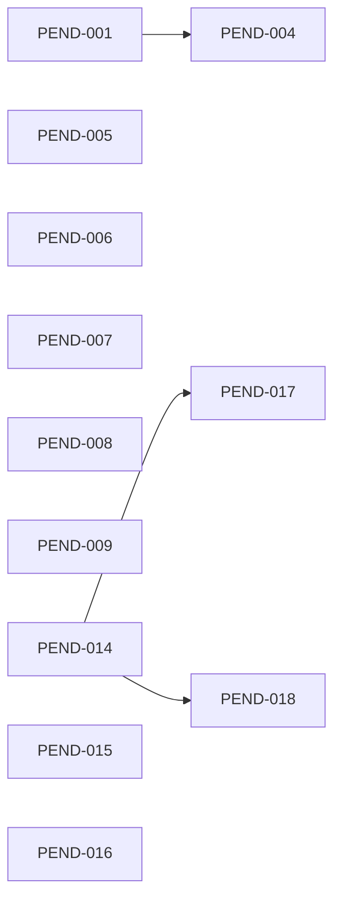
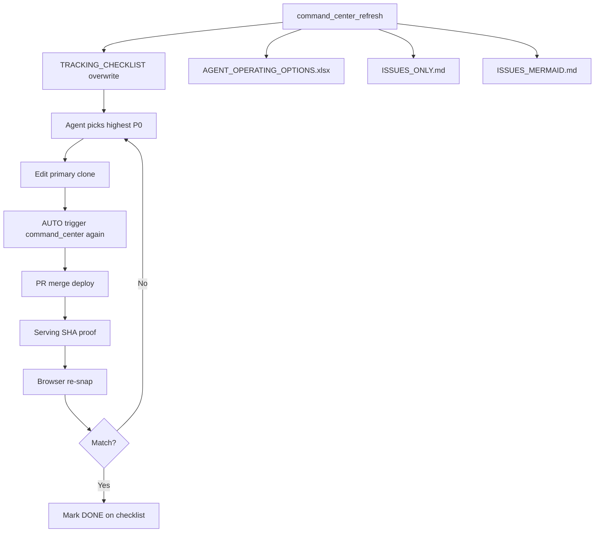

# ISSUES MERMAID (overwrite)

Serving `01a4592f4c68c120a26b4fd955d1aff655b82e33` · gates 3/7

## P0 dependency micro-network

## Full control loop

## Advanced solution order (agent-first)

1. OPT-A1 deploy chain+API aliases  
2. OPT-A10 keep command_center as only probe source  
3. OPT-A3 deploy lag  
4. OPT-A4 scheduler  
5. OPT-A5 paper persistence  
6. OPT-A6 signals  
7. OPT-A7 ML gates (long)
