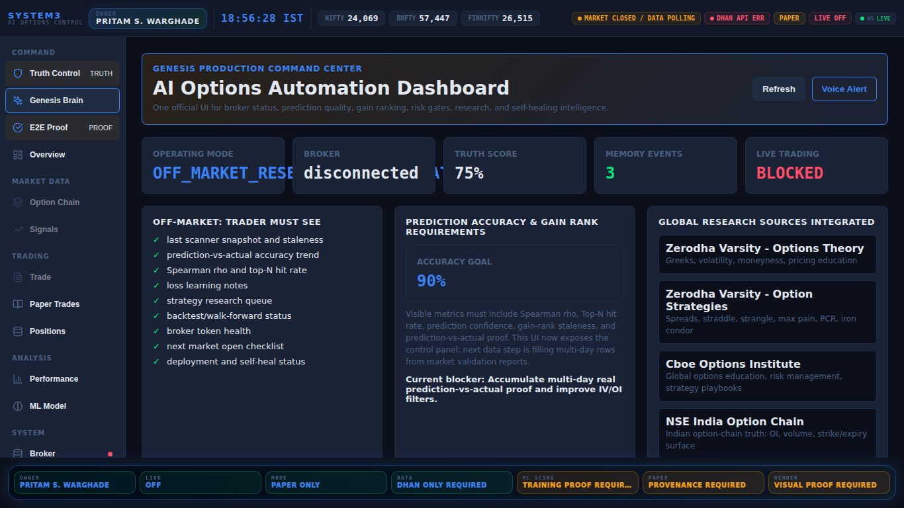
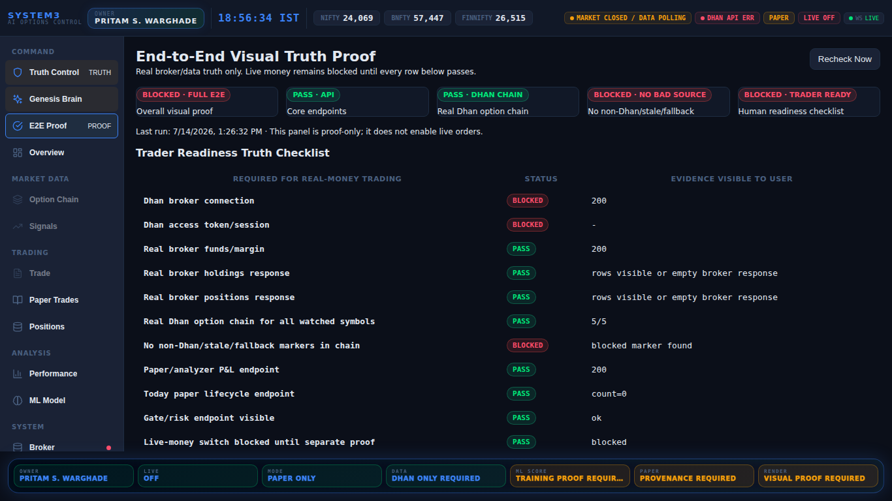
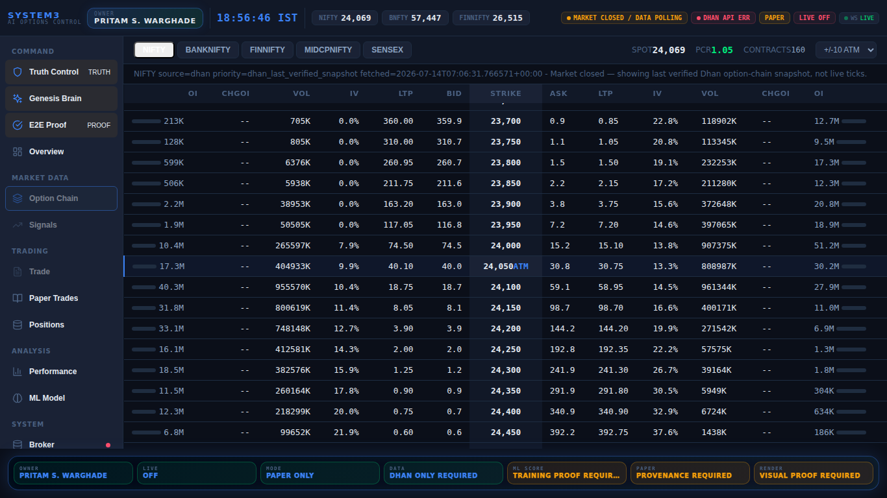
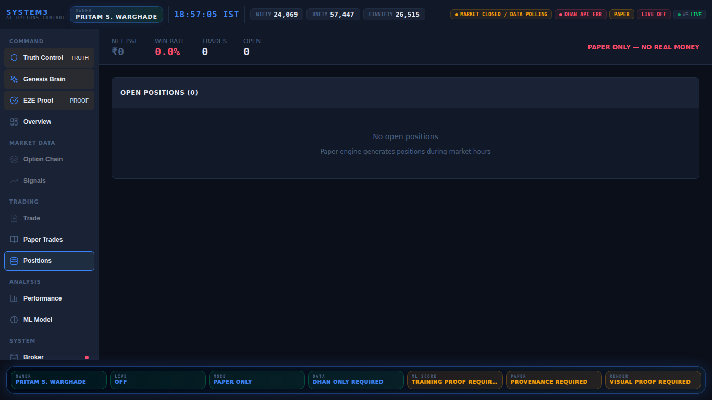
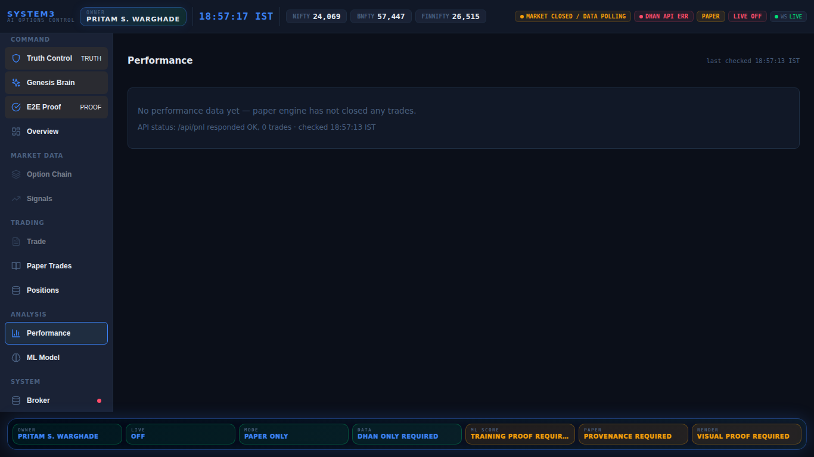

# Dashboard Visual Production Proof

Generated: 2026-07-14T13:23:08.038Z
Base: https://genesis-system3-backend.onrender.com
Visual gate pass: **True**
Production-grade claim allowed: **True**
Source verdict: **PASS**
Auth OK: **True**
Screenshot gate: **True**

## Blockers
- none

## Screenshots
- PASS `truth.png` size=`204447`
- PASS `genesis.png` size=`281537`
- PASS `e2e_proof.png` size=`197735`
- PASS `overview.png` size=`157040`
- PASS `chain.png` size=`223244`
- PASS `signals.png` size=`128567`
- PASS `paper.png` size=`175951`
- PASS `positions.png` size=`111610`
- PASS `broker.png` size=`158242`
- PASS `performance.png` size=`110983`
- PASS `ml.png` size=`140361`
- PASS `gates.png` size=`141142`
- PASS `mobile_390x844.png` size=`123117`

## truth.png

## genesis.png

## e2e_proof.png

## overview.png

## chain.png

## signals.png

## paper.png

## positions.png

## broker.png

## performance.png

## ml.png

## gates.png

## mobile_390x844.png

