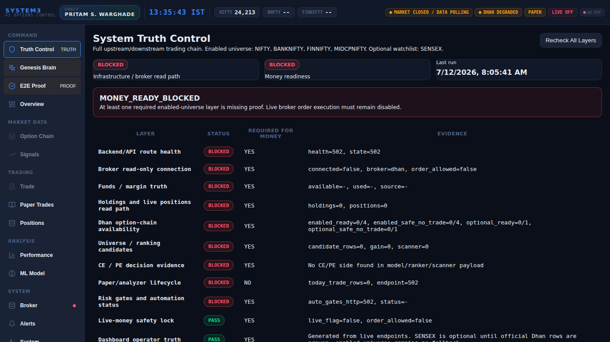
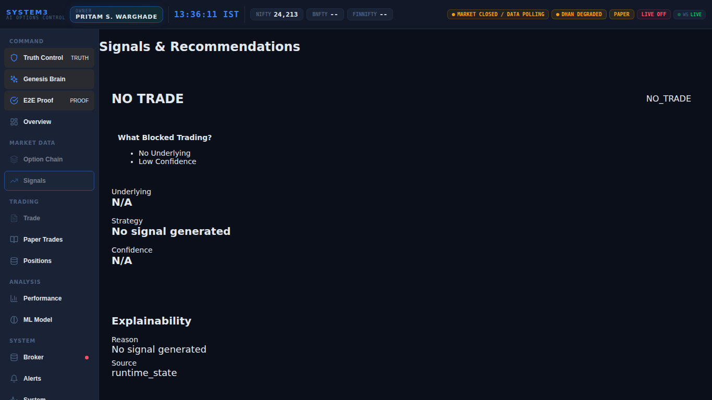
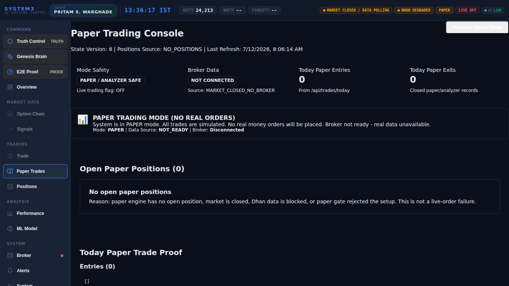
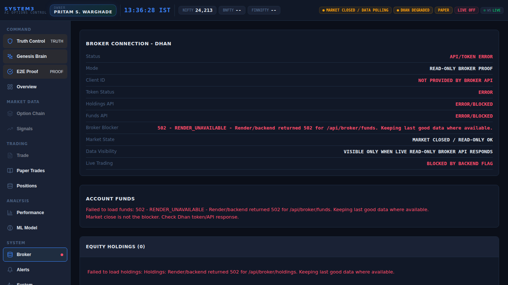
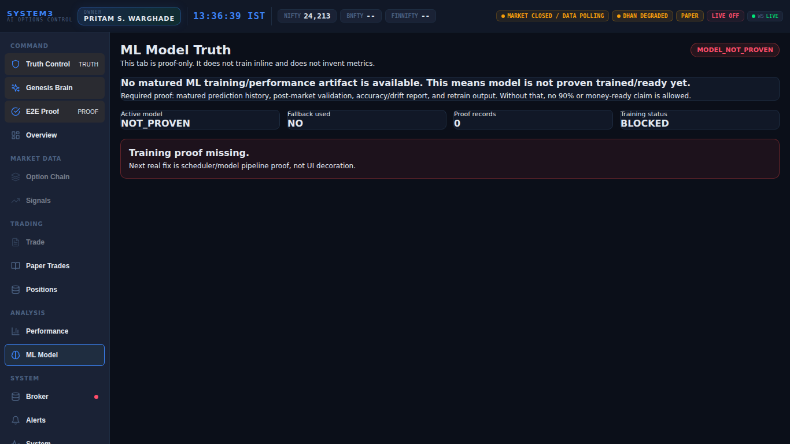
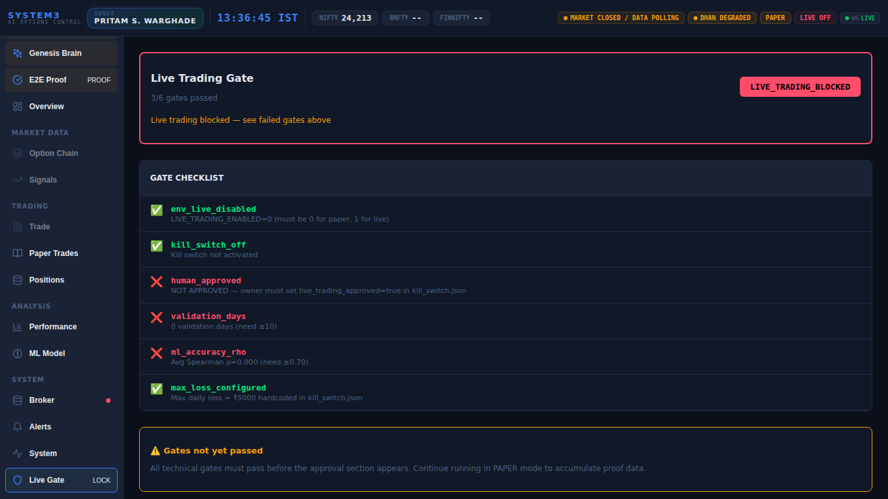
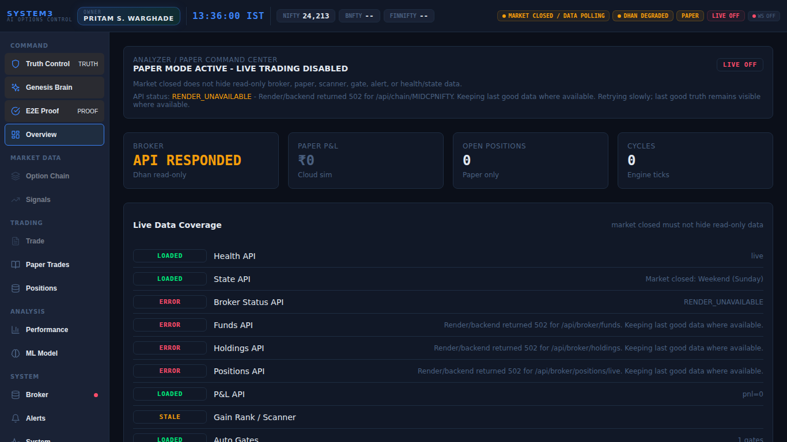
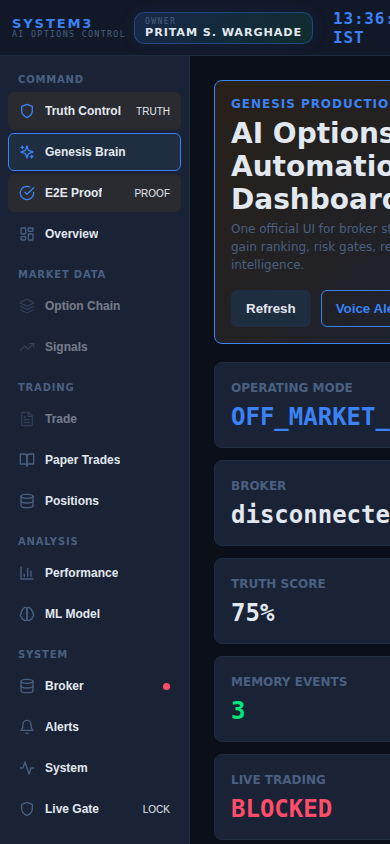

# Dashboard Visual Production Proof

Visual gate pass: **True**

- PASS `truth.png` size=`177671`
- PASS `signals.png` size=`87931`
- PASS `paper.png` size=`127266`
- PASS `broker.png` size=`125223`
- PASS `ml.png` size=`97865`
- PASS `gates.png` size=`109980`
- PASS `overview.png` size=`143620`
- PASS `mobile_390x844.png` size=`90691`

## truth.png

## signals.png

## paper.png

## broker.png

## ml.png

## gates.png

## overview.png

## mobile_390x844.png

