# Dashboard Visual Production Proof

Generated: 2026-08-05T11:05:33.504Z
Base: https://genesis-system3-web-doq2wplepa-el.a.run.app
Visual gate pass: **False**
Production-grade claim allowed: **False**
Source verdict: **FAIL**
Auth OK: **True**
Screenshot gate: **True**

## Blockers
- UI_FAIL:Paper Trades
- PAPER_TRUTH_NOT_VISIBLE:Paper Trades
- PAPER_TRUTH_NOT_VISIBLE:GLOBAL
- SHELL_STATUS:BLOCKED
- TAB_COVERAGE:0/16
- SHELL_PROOF_NOT_TIME_ALIGNED
- VISIBLE_TRACKER_STATUS:BLOCKED

## Corroborating evidence
- `shell_generated_at`: `2026-07-27T23:56:42.530Z`
- `shell_status`: `BLOCKED`
- `shell_tab_coverage`: `0/16`
- `visible_tracker_generated_at`: `2026-08-05T10:57:38.508Z`
- `visible_tracker_status`: `BLOCKED`
- `visible_tracker_bad_tab_count`: `0`

## Screenshots
- PASS `truth.png` size=`167294`
- PASS `genesis.png` size=`255217`
- PASS `e2e_proof.png` size=`164066`
- PASS `overview.png` size=`123541`
- PASS `chain.png` size=`201284`
- PASS `signals.png` size=`157193`
- PASS `paper.png` size=`162710`
- PASS `positions.png` size=`83345`
- PASS `broker.png` size=`114218`
- PASS `performance.png` size=`122669`
- PASS `ml.png` size=`134709`
- PASS `gates.png` size=`118938`
- PASS `mobile_390x844.png` size=`75787`

## truth.png

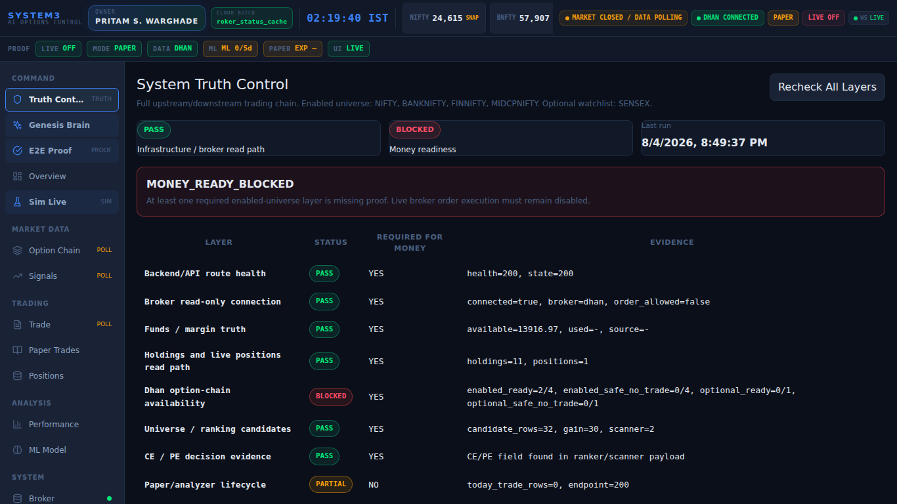

## genesis.png

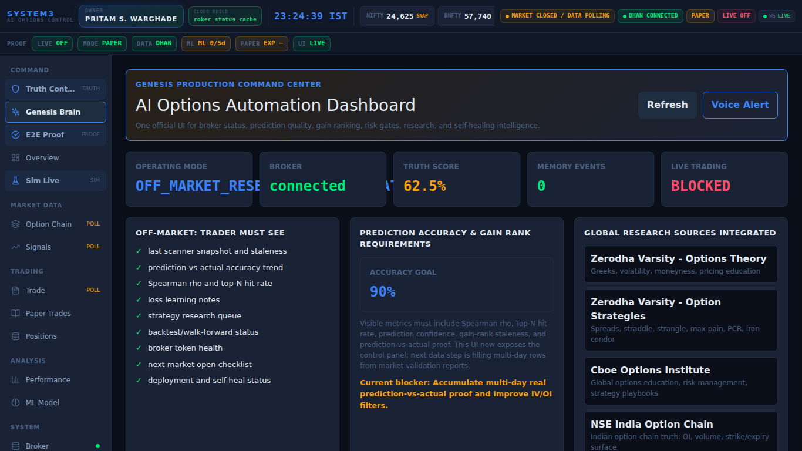

## e2e_proof.png

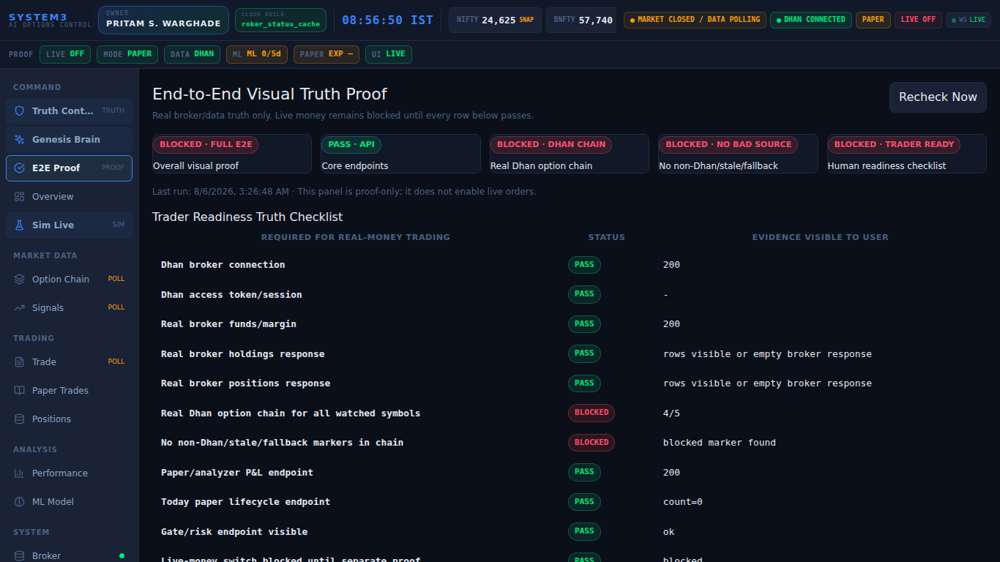

## overview.png

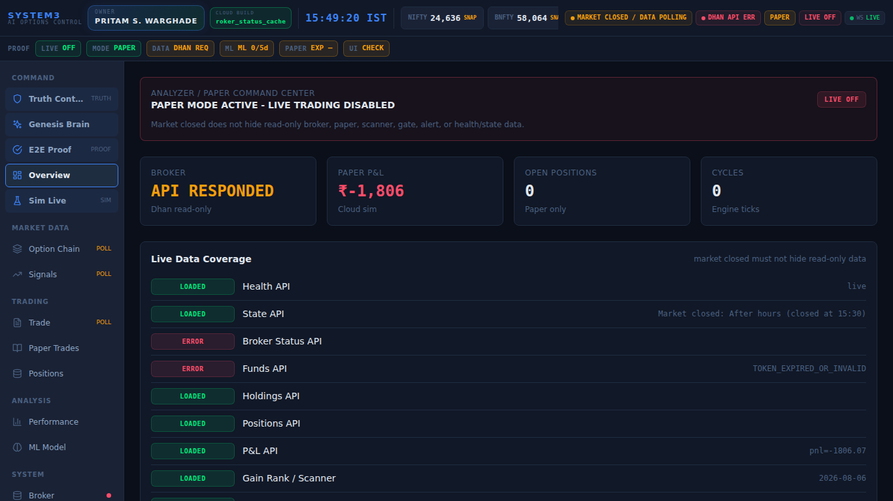

## chain.png

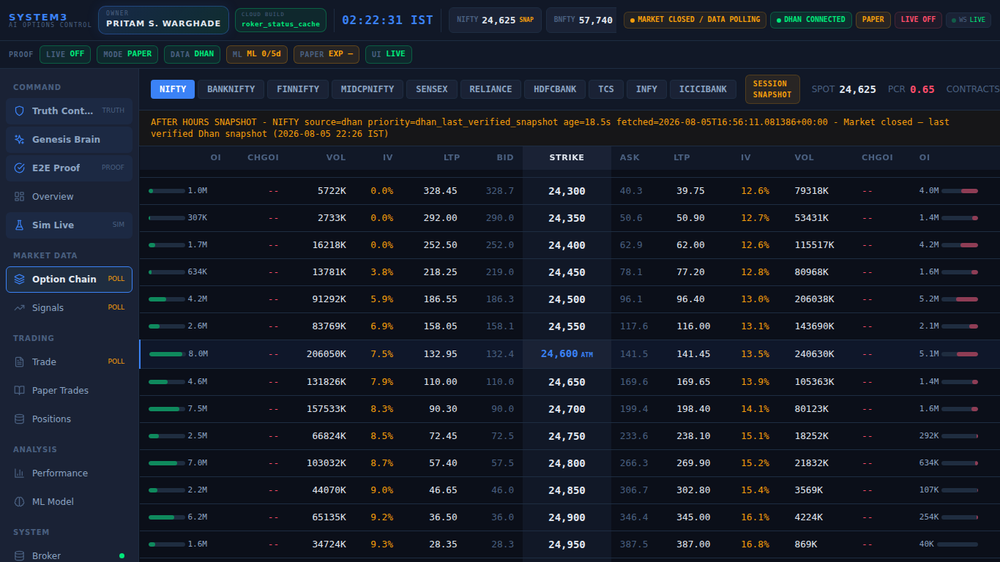

## signals.png

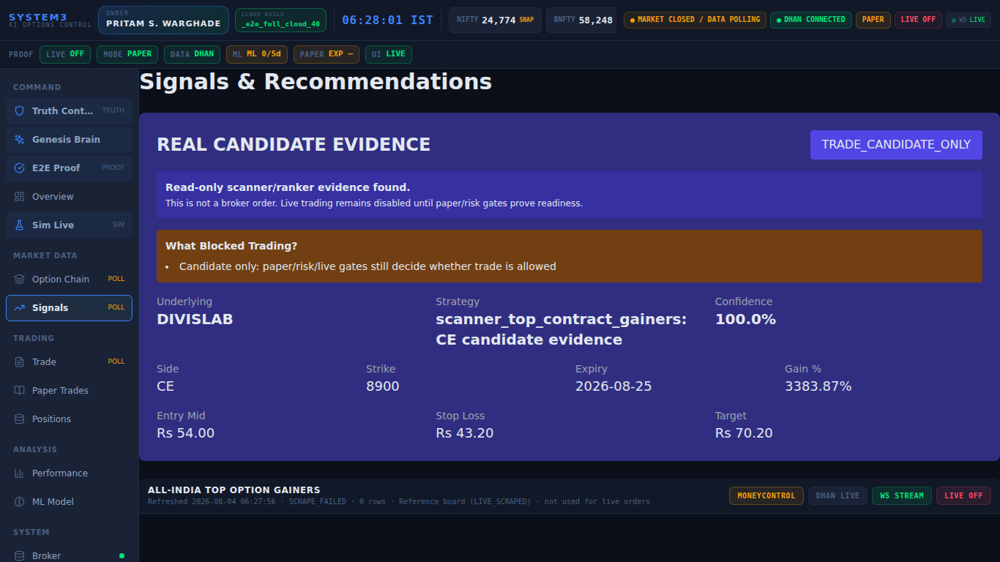

## paper.png

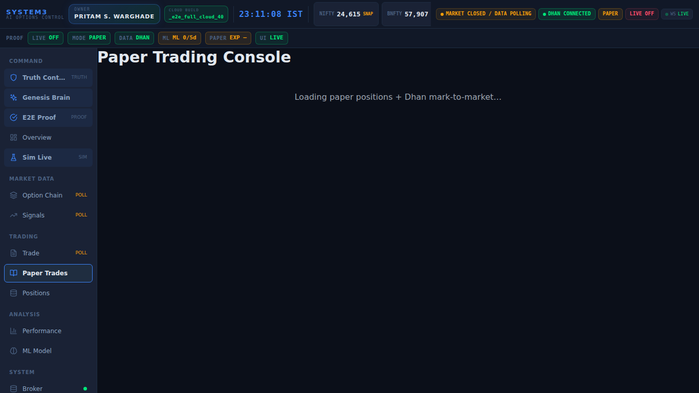

## positions.png

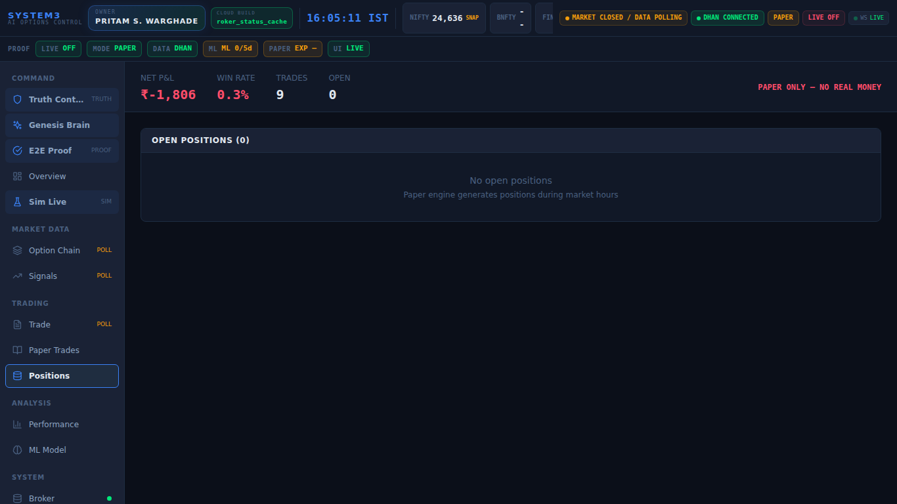

## broker.png

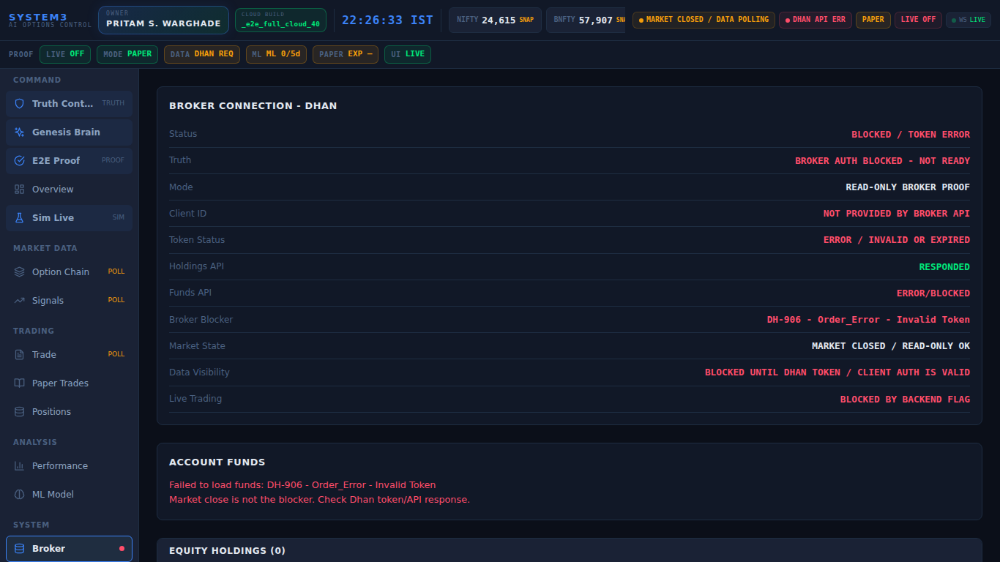

## performance.png

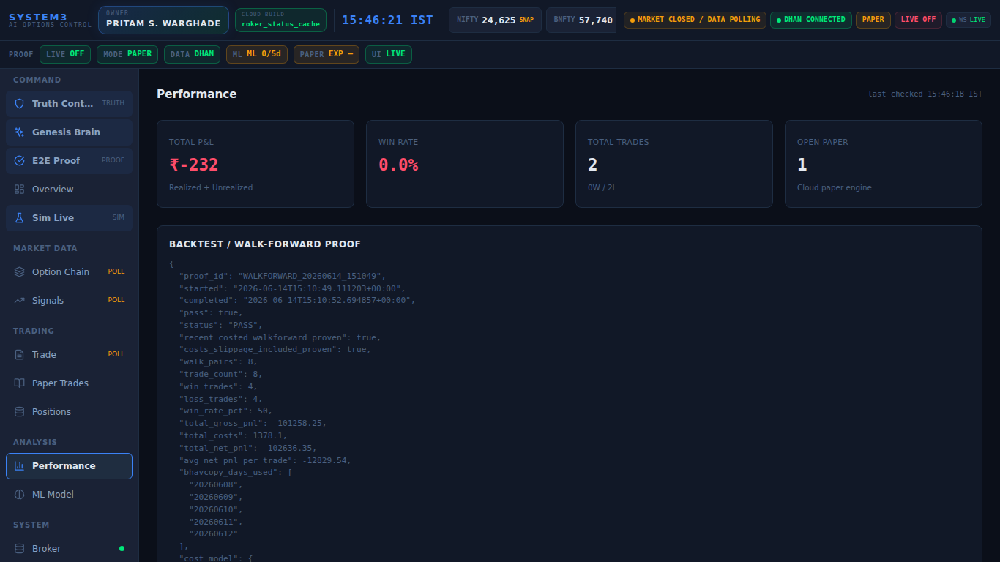

## ml.png

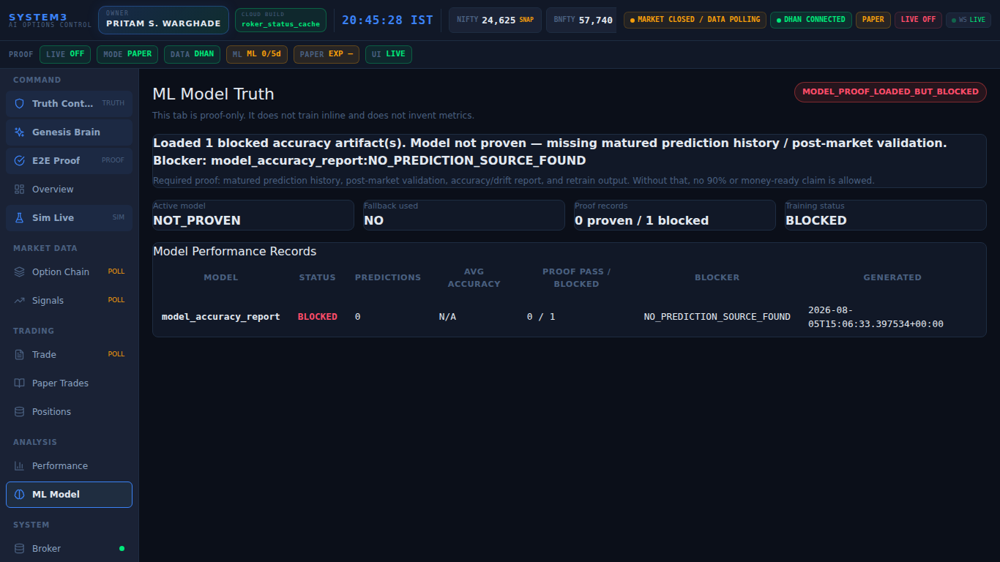

## gates.png

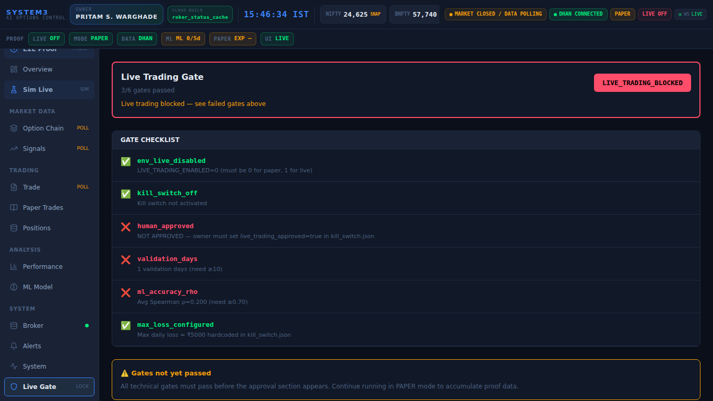

## mobile_390x844.png

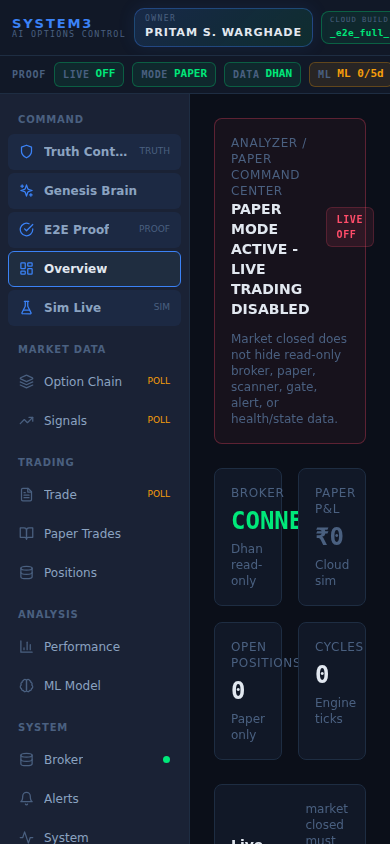
