# Ultra Dashboard Actual Tab Screenshots

Mockup: `false`

## Overview

Route: `/` Pass: `true`

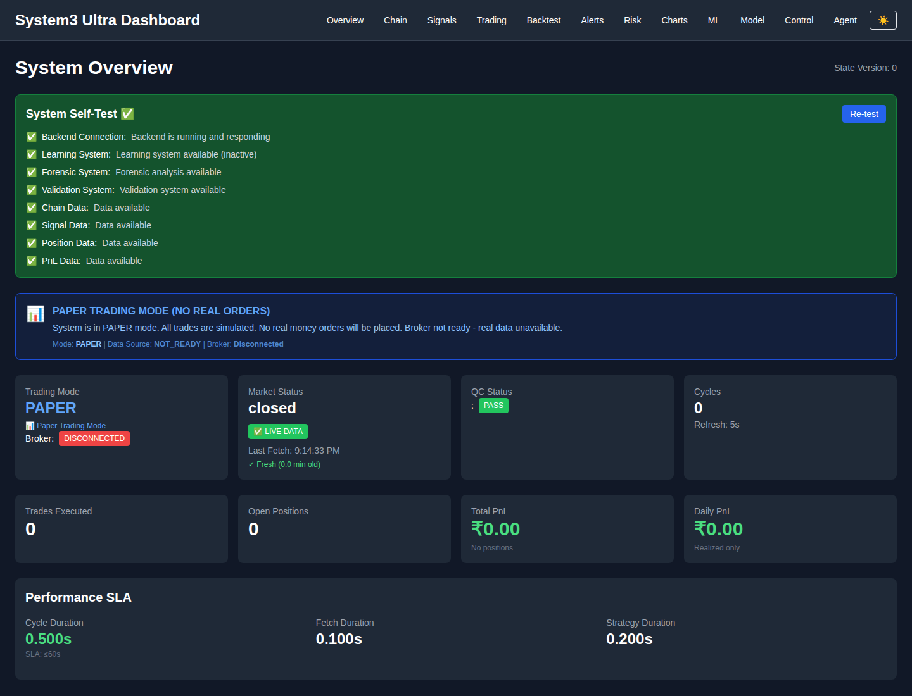

## Chain

Route: `/chain` Pass: `true`

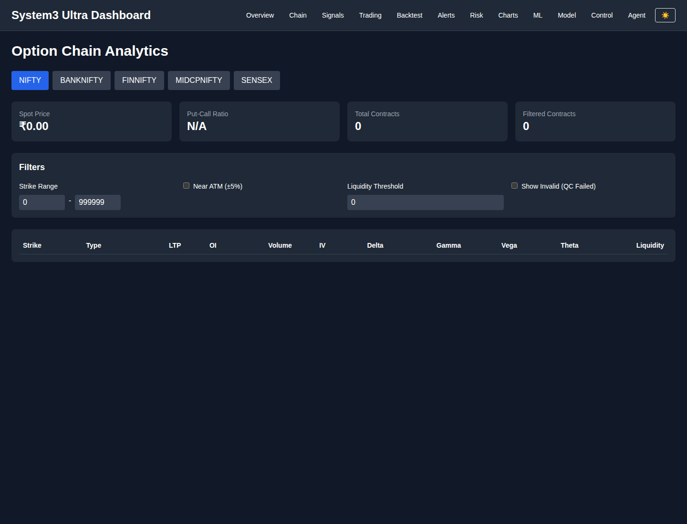

## Signals

Route: `/signals` Pass: `true`

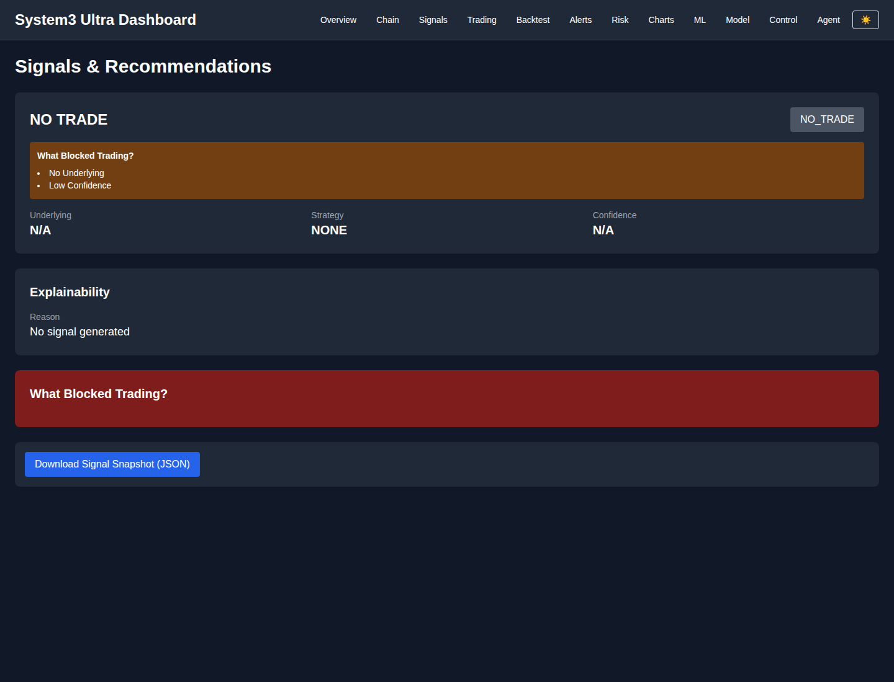

## Trading

Route: `/trading` Pass: `true`

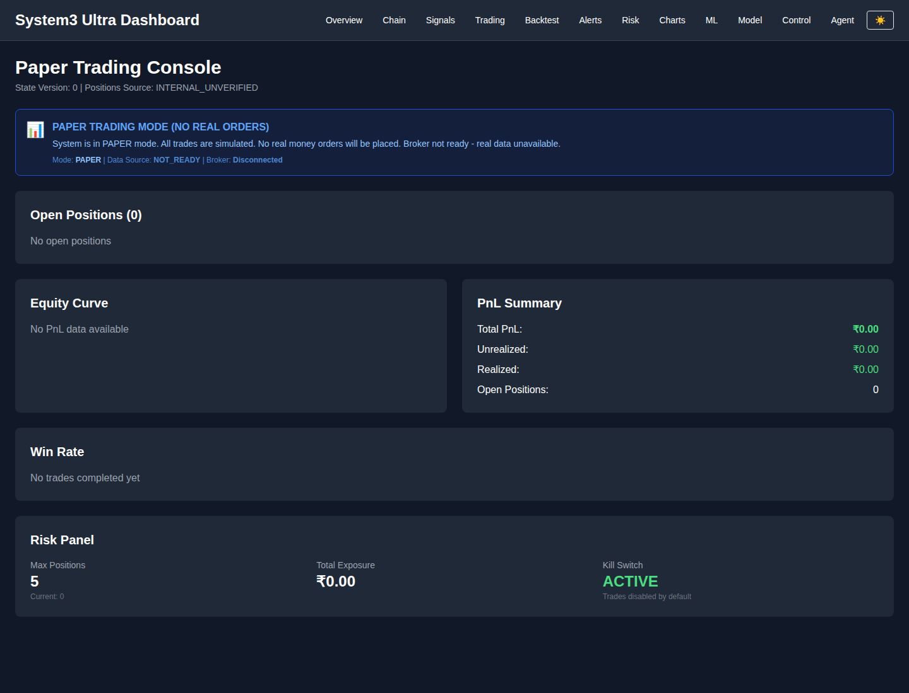

## Backtest

Route: `/backtest` Pass: `true`

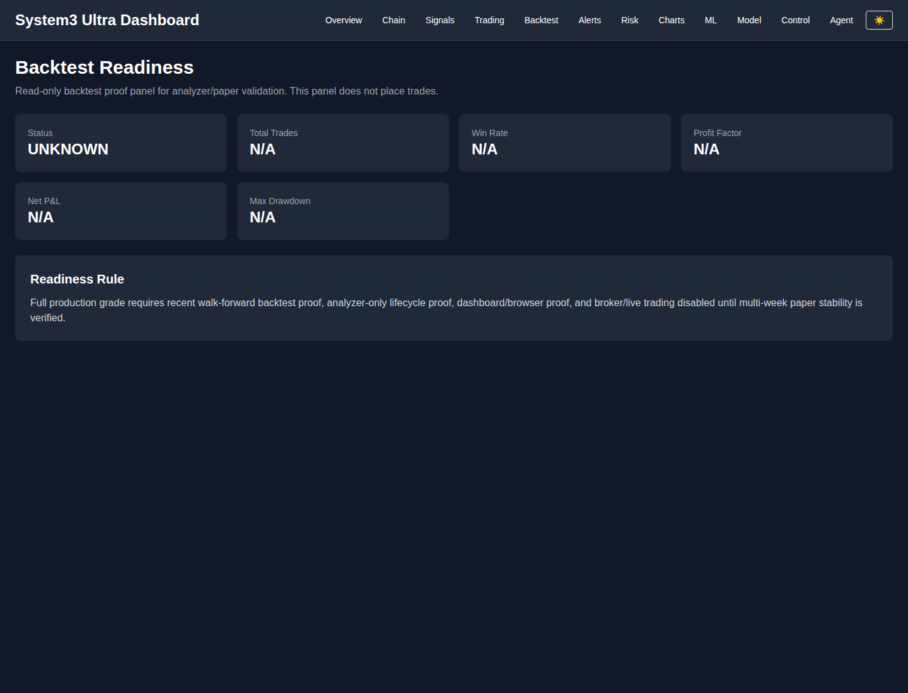

## Alerts

Route: `/alerts` Pass: `true`

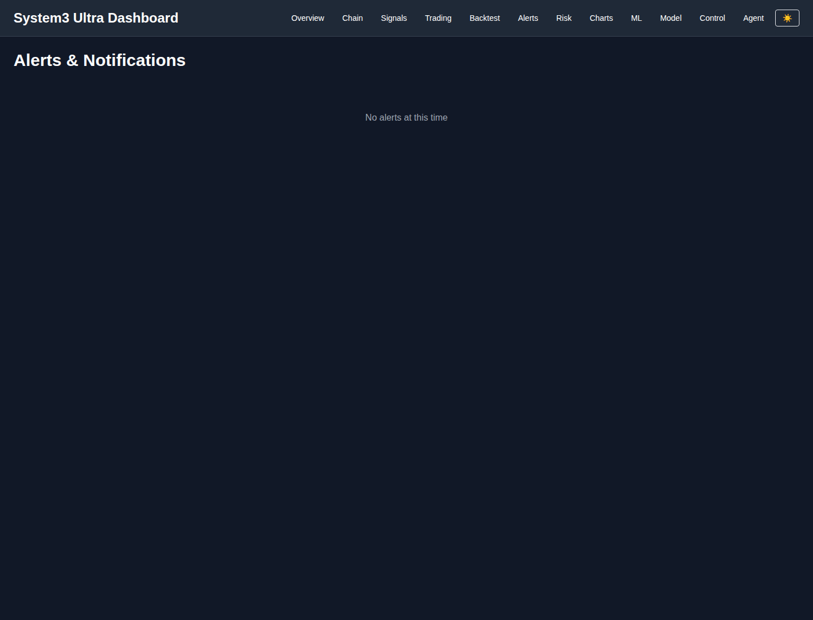

## Risk

Route: `/risk` Pass: `true`

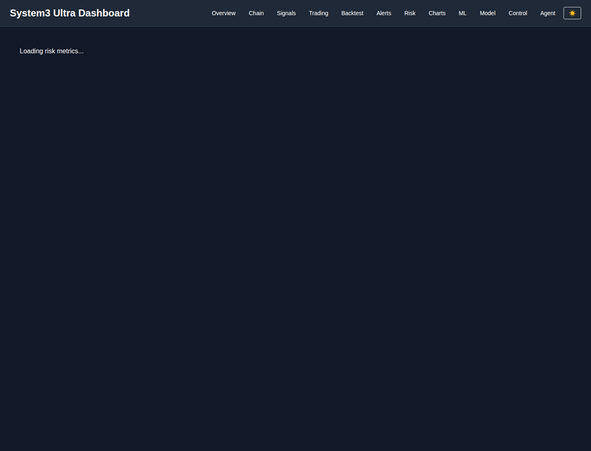

## Charts

Route: `/charts` Pass: `true`

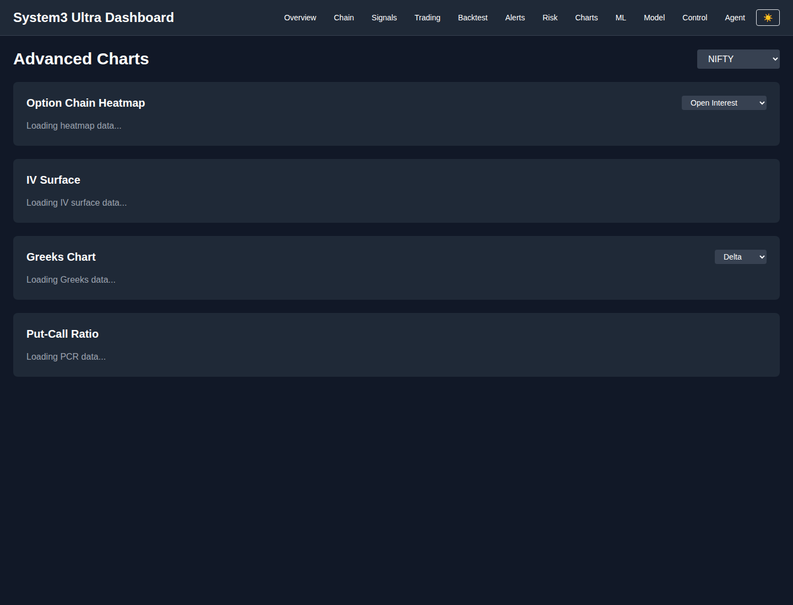

## ML

Route: `/ml` Pass: `true`

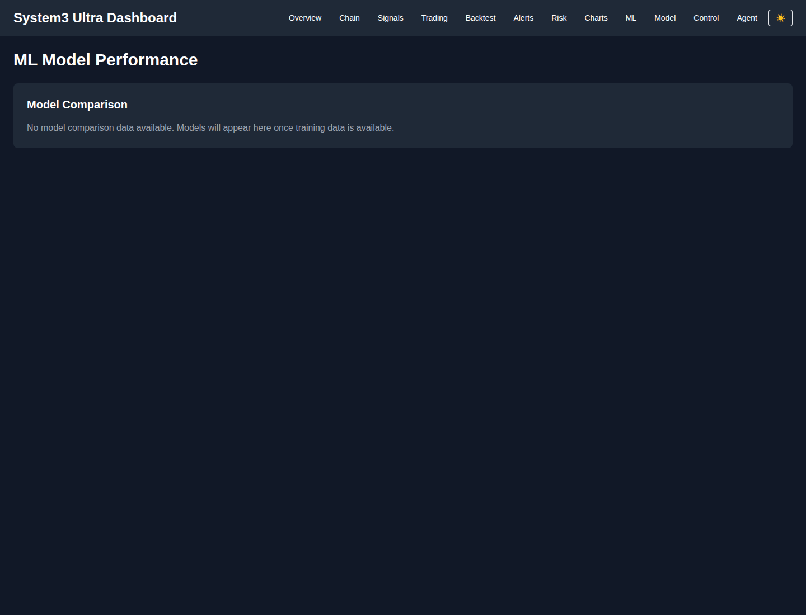

## Model

Route: `/model` Pass: `true`

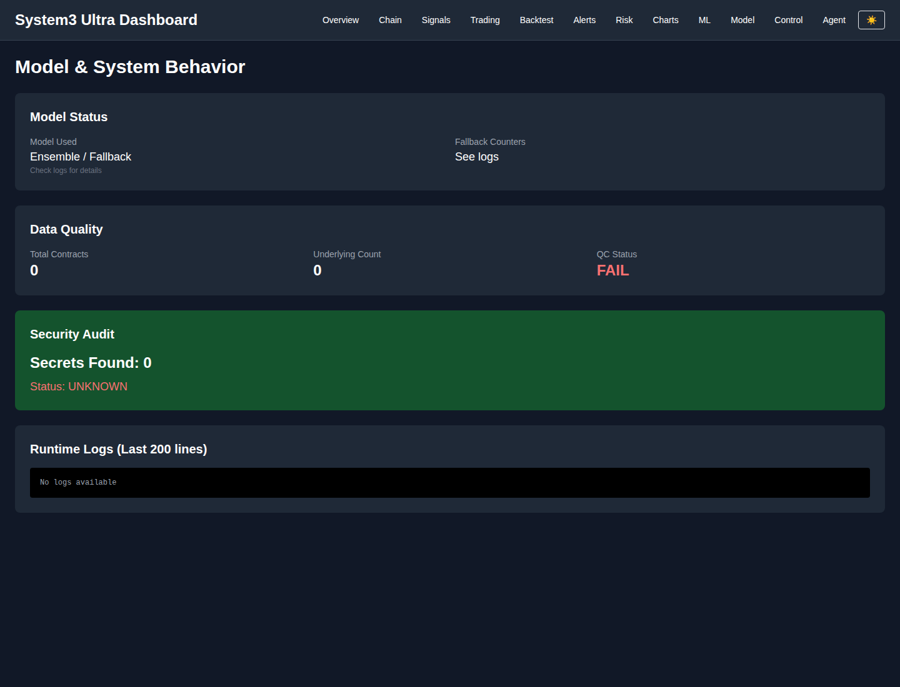

## Control

Route: `/control` Pass: `true`

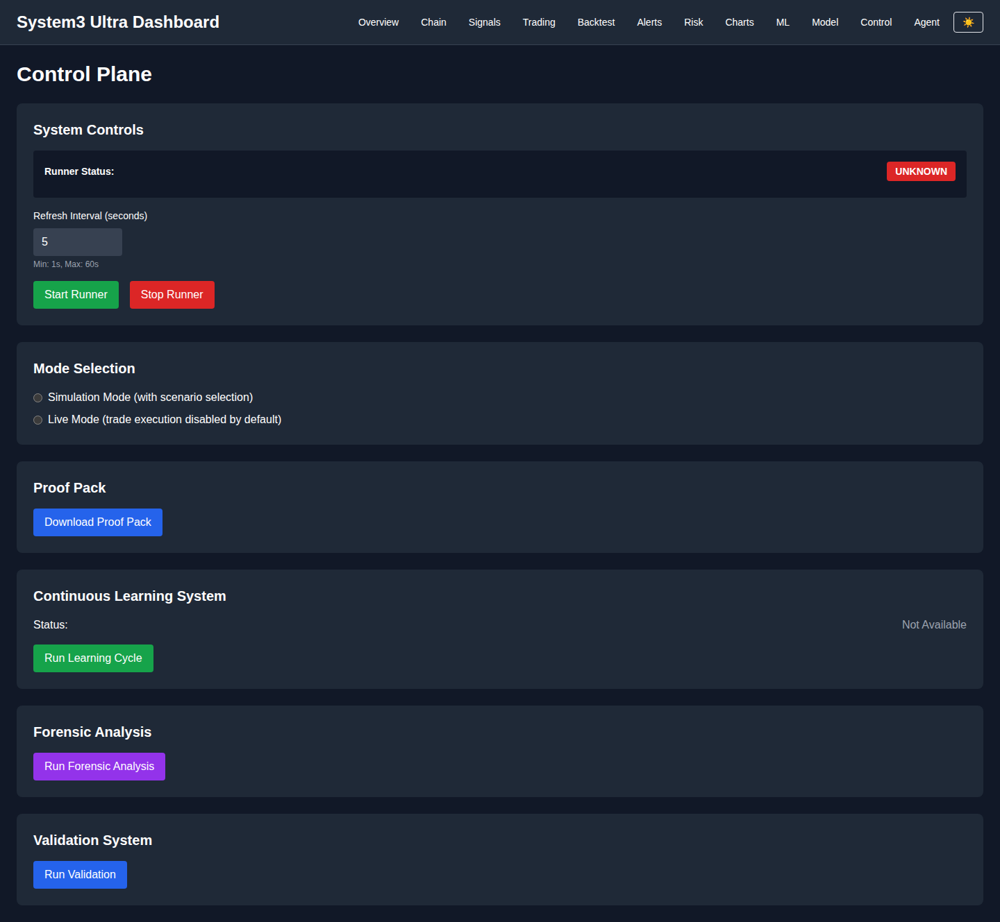

## Agent

Route: `/agent` Pass: `true`

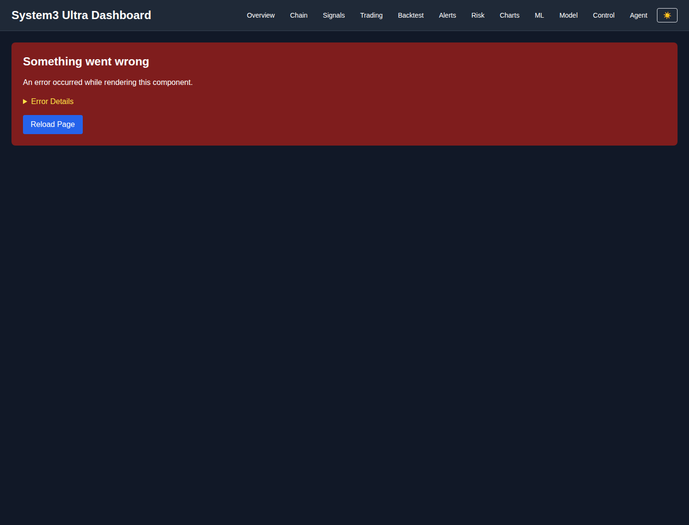

