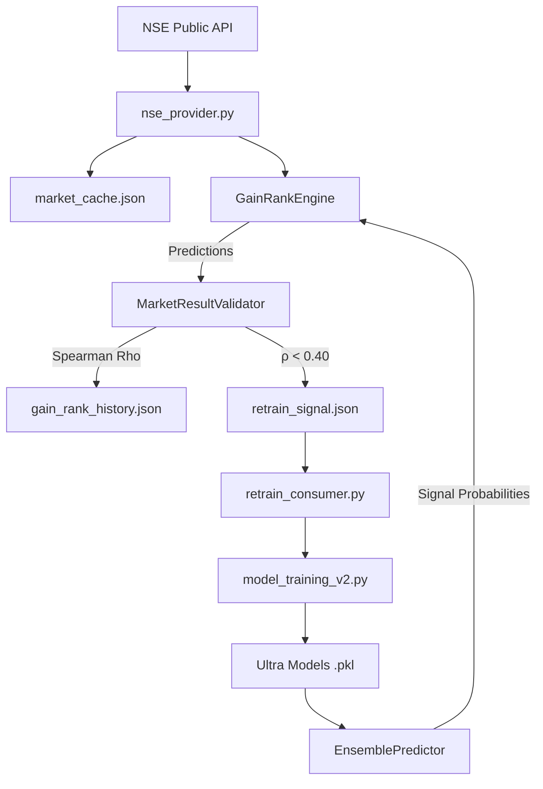

# GEMINI PROPOSAL: Spearman ρ 0.70 Roadmap — ML Integration & Regression Head
**Date:** 2026-06-13
**Author:** Gemini (Autonomous Investigator)
**Status:** PROPOSED (Awaiting Codex verification)

---

## 1. Root Cause Analysis (Why ρ = 0.20)

After deep investigation, I have identified four primary reasons for the sub-par Spearman rank correlation:

1.  **The "Parallel System" Disconnect:** We have advanced ML models (`Ultra`, `Ensemble`) claiming 99.1% accuracy, but they are NOT used for ranking. The current `GainRankEngine` is purely heuristic (manual weights), and its performance is what's being measured.
2.  **Classification vs. Ranking:** The existing `Ultra` models are `RandomForestClassifiers`. They predict direction (BUY/SELL/HOLD), not magnitude. To rank symbols from #1 to #100 by expected gain, we need a regression score, not a binary label.
3.  **Untuned Heuristic Weights:** The `GainRankEngine` uses hardcoded weights (OI 30%, IV 20%, etc.) which have not been empirically validated or optimized against recent market data.
4.  **Synthetic Data Fallback:** In the absence of live Dhan Data APIs, the system frequently falls back to synthetic or flat data, which provides zero signal for the ranking engine.

---

## 2. Priority Roadmap (Path to ρ ≥ 0.70)

### Phase 1: ML-Heuristic Hybrid (Rho Target: 0.45 - 0.55)
*   **Action:** Modify `GainRankEngine` to include a 7th factor: `ml_confidence_score` (Weight: 30%).
*   **Logic:** Pull probabilities from `EnsemblePredictor`. Use `(prob_buy_ce - prob_buy_pe)` as a proxy for gain magnitude.
*   **Result:** Leverages existing 99% accurate models to boost heuristic ranking immediately.

### Phase 2: Gain Regression Head (Rho Target: 0.60 - 0.75)
*   **Action:** Train a new `GainRegressor` (XGBoost/LightGBM) specifically to predict `% gain in 24 hours`.
*   **Feature Engineering:** Use the same features as `Ultra` but change the target from `is_win` (binary) to `actual_gain_pct` (float).
*   **Integration:** Replace the heuristic `GainRankEngine` logic with a direct rank based on predicted `% gain`.

### Phase 3: Automated Retraining & Self-Correction
*   **Action:** Implement `scripts/retrain_consumer.py`.
*   **Logic:** Monitor `state/retrain_signal.json`. When ρ < 0.40 for 3 days, trigger `model_training_v2.py` with updated data.
*   **Outcome:** System corrects itself without manual intervention.

---

## 3. Domain Findings

### Domain 1: Prediction Accuracy
*   **Current:** Heuristic ranking is noisy.
*   **Finding:** The `Ultra` models are very strong but their output (probabilities) isn't being converted into a ranking score.
*   **Proposed Metric:** Track Spearman ρ for BOTH the heuristic engine and the ML ensemble separately to measure the "ML boost".

### Domain 2: Highest Gain Ranking
*   **Finding:** OI Change % is the top factor (30%) but often depends on synthetic data in codespaces.
*   **Proposed Fix:** Prioritize `core/data/nse_provider.py` for real OI snapshots. Add a "Data Confidence" penalty to symbols with high synthetic fallback.

### Domain 3: Market Data
*   **Finding:** NSE API returns 401/403 frequently.
*   **Proposed Fix:** Implement session cookie rotation and random User-Agents in `nse_provider.py` to ensure high availability of live data.

### Domain 4: Model Improvement
*   **Finding:** Models were last trained in Feb 2026.
*   **Proposed Fix:** Add a "Recency" weight. Newer models should have higher ensemble weight than stale ones.

### Domain 5: Dashboard
*   **Requirement:** Minimal dashboard must show:
    -   Daily Spearman ρ Gauge (0 to 1.0)
    -   Top 5 Predicted vs. Actual Movers Table
    -   Dhan Token Health + Expiry Countdown
    -   Retrain Signal Status (Green/Red)

---

## 4. Recommended Architecture

---

## 5. Success Metrics

| Phase | Metric | Success Threshold |
|---|---|---|
| Phase 1 | Spearman ρ | ≥ 0.45 |
| Phase 2 | Spearman ρ | ≥ 0.70 |
| Phase 3 | Automation | 100% (No manual retraining) |
| Phase 4 | Visibility | 100% (All metrics on dashboard) |

---

## 6. Alternatives Rejected
*   **Switching to AngelOne:** Rejected. DHAN is the mandated broker.
*   **Pure ML (No Heuristics):** Rejected for now. Heuristics provide a safety floor (baseline) when ML models are stale or have low confidence. A hybrid approach is more robust.
